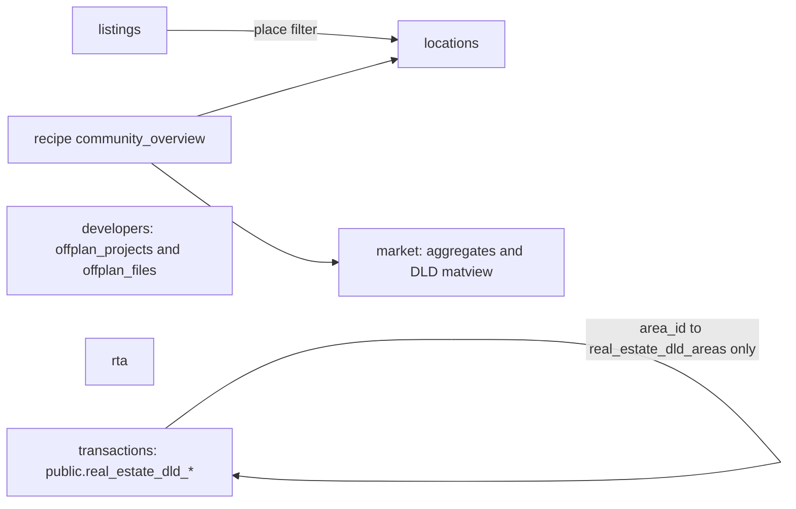

# Phase 2: Re-target catalog packs from the legacy design (data only)

## Ground rules
- Production warehouse (`propqaproduction_backup`) decides which tables and columns exist. Tables that exist there but that `propqa_chatbot` can't SELECT stay in the packs and go on the ops list. Legacy tables missing from production are not added (RTA monthly passenger trips, `*_ridership`, fleets, capacity, bus speed, `school_buses`).
- Additive: keep current tables. Remove only explicit legacy exclusions and the two swaps below.
- Edit only [src/catalog/domains/*.yaml](src/catalog/domains/), [src/catalog/domains/index.yaml](src/catalog/domains/index.yaml), [src/catalog/recipes.yaml](src/catalog/recipes.yaml), [src/catalog/profiles/*.yaml](src/catalog/profiles/), and new cases in [src/evals/](src/evals/).
- Use only keys the loader already reads: table `name`, `qualified_name`, `description`, `primary_key`, `foreign_keys`, `columns[]`, `segments`, `basis`; pack `description`, `grain`, `joins`, `pitfalls`, `named_values`, `enums`. Pack `joins:` is prompt-only, so every cue, join and ban rule goes into `pitfalls` or table `description` text.
- Every `chatbot_ai.*` reference stays schema-qualified (the search path is `"$user", public`).

## Ownership after the change

## Per-pack edits (one commit each)

1. **listings** ([listings.yaml](src/catalog/domains/listings.yaml))
   - Add `public.amenity_property`, `public.views`, `public.property_view`, `public.nearby_locations` and `public.nearby_location_property`.
   - Move `public.amenities` here from the amenities pack.
   - Pitfalls describe the join contract:
     - `FROM public.properties`, location via `location_v2_id`, with the 3 legacy foreign keys as fallback.
     - Type, amenity, view and nearby filters via EXISTS.
     - Never JOIN DLD tables to `properties`; use transactions or market.
   - Do not add `users` or `user_sub_roles`.

2. **transactions** ([transactions.yaml](src/catalog/domains/transactions.yaml))
   - Swap the sale and rent fact tables to `public.real_estate_dld_transactions` (date `instance_date`, value `actual_worth`) and `public.real_estate_dld_rent_contracts` (date `contract_start_date <= CURRENT_DATE`, value `annual_amount`).
   - Add `real_estate_dld_areas`, `real_estate_dld_projects`, `real_estate_dld_developers` and `real_estate_dld_buildings`; extended: `real_estate_dld_units`, `real_estate_dld_land_registry`.
   - Drop `chatbot_ai.real_estate_transactions`, `rent_contracts`, `real_estate_transaction_groups`, `real_estate_transaction_procedures` and `real_estate_market_types`.
   - Keep `property_valuation_records` and `residential_sale_index`.
   - Joins:
     - Facts join `real_estate_dld_areas` on `area_id`.
     - `real_estate_dld_projects` joins `real_estate_dld_developers` on `developer_id`.
     - Buildings and units join projects on `project_id`.
     - Transactions reach projects only by `project_name_en` (`project_number` matches about 38%).
   - Never put sale-only columns (`actual_worth`, `meter_sale_price`) on rent tables.
   - Re-point `named_values` to the same columns on the `public` tables.

3. **market** ([market.yaml](src/catalog/domains/market.yaml))
   - Add `public.rental_contract_summary`.
   - Note: quote `mv_community_dld_market_metrics` KPIs only when the matching `*_data_quality = 'ok'`.
   - Hand community lifestyle questions to locations, and single deals or volumes to transactions.

4. **locations** ([locations.yaml](src/catalog/domains/locations.yaml))
   - Add `public.locations_v2`, `nlp_search_locations`, `nlp_search_pois`, `nlp_search_roads`, `pf_locations`, `places` and `public.mv_community_landing_metrics`; extended: `bayut_locations`, `countries`, `nlp_search_location_sources`.
   - Not added: PostGIS system views, which answer no user question.
   - Rules:
     - `area_insights_communities`: never `SELECT *`; `description` is always null; exact-first match on `title_en`, then `ILIKE`.
     - Join insights to the landing matview by `lower(title_en) = lower(community_name)`, or by `area_insights_id`.
     - `area_insights_communities.location_id` points to `locations_v2`.
     - Never JOIN `locations.area_id` to `real_estate_dld_areas`.
     - Time filters use `created_at` only for clearly temporal questions.
   - Names:
     - Aliases: JVC, JVT, JGE, MBR City, BB, Creek Harbour.
     - False friends: Business Bay is not Marasi Business Bay; Dubai Marina is not Dubai Marina Mall.
   - Add a `named_values` entry: `chatbot_ai.area_insights_communities.title_en`, kind `community`.

5. **developers** ([developers.yaml](src/catalog/domains/developers.yaml))
   - Swap `public.offplan_projects_new` for `public.offplan_projects` plus `public.offplan_files`.
   - Join `fileable_type = 'App\Models\offplan' AND fileable_id = offplan_projects.id`.
   - Default area filter is `ILIKE offplan_projects.location`. `locations` is only for community-level follow-ups.
   - `handover_date` is text.
   - Never cross-join the off-plan catalog with DLD tables or `properties`.
   - Re-point `named_values` (`developer_name_en`, `project_name_en`, `location`).
   - Reconcile `amenities.yaml` notes that mention `offplan_projects_new`.

6. **rta** ([rta.yaml](src/catalog/domains/rta.yaml))
   - Remove `chatbot_ai.public_transportation_stations`.
   - Keep `metro_stations_gis`, which grounding needs.
   - Add any of `total_road_length_by_functional_classification_km`, `average_bus_speed_per_line` and `dubai_metro_and_tram_capacity` only if they exist on production. Check this read-only first.
   - Rules:
     - Bus joins use 6-digit `bus_stops_gis.bus_stop_id` = `public_transportation_routes_stops.stop_id`. Never use `bus_stop_details.stop_id` (4 digits); `bus_routes` joins by name only.
     - `parking_rates.zone` is a tariff band (A, B, C, D, Multi-Storey), never an area code.
     - Parking spaces come from `bus_network_coverage` JOIN `number_of_parking_spaces_per_zone` on `community_num`.
     - Marine: `marine_stations` and `marine_stations_gis` join on `station_id`; `marine_lines` joins by station name.
   - Display renames: DAMAC Properties becomes Sobha Realty; Nakheel becomes Al Fardan Exchange.

7. **amenities, schools, agencies, regulations**: no table changes except moving `public.amenities` out. Add handoff lines only:
   - Lifestyle and schools narrative for a community goes to locations.
   - Building or listing amenities go to listings.

8. **index.yaml**: short blurb edits so `description` and `not_for` encode ownership and handoffs. Update `table_count`. Fix the stale "rent contracts end in 2021" claim.

## Recipe
- Add `community_overview` (domains `[locations, market]`, parameter `community` bound from the new `area_insights_communities.title_en` `named_values` entry).
  - It joins `area_insights_communities` with `mv_community_landing_metrics` and `mv_community_dld_market_metrics` on the lower-cased name.
  - It selects named columns only, and DLD KPIs only when their quality flag is `'ok'`.
- Not added: nearest metro to a community or building (needs `metro_stations_gis`, which production denies), bus corridor A to B, and "sold most off-plan".

## Evals (new cases only)
- Add to [domain_router_golden.yaml](src/evals/domain_router_golden.yaml):
  - "What's Business Bay like": locations plus market, recipe `community_overview`, never transactions.
  - "2-bed rent near metro": listings only.
  - Brochure for a named project: developers.
  - Metro ridership in March: rta.
  - Parking tariff zone B: rta.
  - Registered rents in JVC last month: transactions.
  - Community yield: market.
- Add to [sql_golden.yaml](src/evals/sql_golden.yaml): `sql_contains` cases for each cue-to-table choice (e.g. `real_estate_dld_rent_contracts`, `bus_stop_id`, `fileable_type`). There is no negative-assertion field, so forbidden-join cases can only check a positive substring (see the list below).

## Verification
- Run `python -m evals.run_domain_eval` before and after. If routing accuracy drops, fix it by editing the blurbs back.
- Run `python -m evals.run_sql_eval`. Its only write is local `logs/sql_eval_*.json`.
- Guard check via a `python -c` one-off: for every table in every pack, `prepare_select` with `tables_in_domains([owner])` must allow it, and the same query with a non-owner pack must reject it.
- Re-profile changed packs with `python -m catalog.profiler`. It reads the warehouse and writes only profile YAML.
- No writes to any database.

## Needs logic change (not done)
- Ops: grant `propqa_chatbot` SELECT on the `chatbot_ai.*` tables the packs use, plus `public.community_info`, `dda_plots`, `offplan_projects_new` and `reelly_project_amenities`. Without it, schools, rta, agencies, regulations, most of developers, locations and amenities, and the near-station listing filter fail on production.
- Hard enforcement of join bans (DLD to `properties`, `locations.area_id` to DLD areas, wrong bus `stop_id`) in `guard.py`.
- Legacy mechanisms with no YAML field: the "block any `dld*` identifier" rule, per-domain table caps (3 and 6), cue-regex table selection, display-rename post-processing.
- `search_listings`: fallback to legacy foreign keys only when `location_v2_id` is NULL, a nearby-location EXISTS filter, `user_sub_roles`.
- Recipes cannot bind lat/lng or a year, so the haversine, bus corridor and "sold most off-plan" bridges can't be recipes.
- The eval harness has no forbidden-domain or forbidden-SQL assertion.