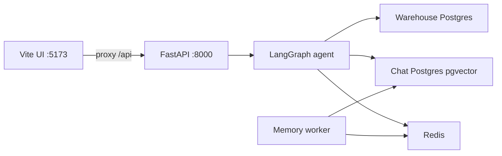

# Propqa

Propqa is a conversational AI agent for the Dubai and UAE property market. It answers questions from stored market data, and uses the model directly for turns that do not need a lookup (greetings, definitions, product help).

The backend is a FastAPI app that streams chat over server-sent events. A LangGraph agent decides whether a turn needs the database. When it does, a domain router loads only the relevant catalog (listings, transactions, locations, developers, schools, RTA, amenities, agencies, regulations, market) and a guarded text-to-SQL tool runs read-only `SELECT`s against the warehouse. The UI is a Vite and React app.

## Architecture



| Piece | Role |
| --- | --- |
| Warehouse Postgres (`AUDIT_DB_*`) | Read-only property data used by text-to-SQL and name grounding |
| Chat Postgres (`CHAT_DB_*`) | Users, refresh tokens, and long-term memory (pgvector) |
| Redis | LangGraph checkpoints, cache, rate limits, and the memory queue |
| Memory worker | Drains the queue and writes long-term memories to Postgres |

Chat tables are created on first use. There is no separate migration step.

## Project layout

| Path | What it is |
| --- | --- |
| `src/app.py` | FastAPI entry point |
| `src/agent/` | LangGraph workflow, SQL, grounding, and memory |
| `src/routes/` | Chat, auth, sessions, and leads |
| `src/auth/` | JWT auth and user storage |
| `src/catalog/` | Domain catalogs the SQL agent loads |
| `src/config/` | Environment loading |
| `Frontend_Gerenal/` | Vite + React UI |
| `compose.yaml` | API, web, worker, Postgres, and Redis |
| `example.env` | Settings template |

## Prerequisites

- Python 3.12 or newer, and [uv](https://docs.astral.sh/uv/)
- Node.js 22
- Docker Desktop, for the chat database and Redis
- An LLM key: `OPENAI_API_KEY` or `ANTHROPIC_API_KEY`, matching `LLM_PROVIDER`
- Read-only warehouse credentials (`AUDIT_DB_*`) for answers that depend on stored listings and market facts

Langfuse tracing is optional. The Jev domain router is optional: set `DOMAIN_ROUTER=llm` to route domains with the LLM instead.

## Configuration

Settings load in two steps (`src/config/settings.py`):

1. A repo-root `.env` file sets `APP_ENV` (default `development`).
2. `{APP_ENV}.env` holds the settings for that environment, for example `development.env`.

Both files are gitignored. `example.env` is the template.

```powershell
copy example.env development.env
Set-Content -Path .env -Value "APP_ENV=development"
```

Then fill in secrets in `development.env`. Grouped variables:

| Group | Variables |
| --- | --- |
| App | `DEBUG`, `BASE_URL`, `APP_HOST`, `APP_PORT`, `TIMEZONE` |
| Warehouse | `AUDIT_DB_*`, `DB_SEARCH_PATH`, `SQL_ROW_CAP`, `SQL_TIMEOUT_MS`, `GROUNDING_*` |
| Chat database | `CHAT_DB_*` |
| Redis | `REDIS_URL`, `CACHE_KEY_PREFIX` |
| Auth | `JWT_SIGNING_KEY`, `JWT_ISSUER`, token TTLs |
| LLM | `LLM_PROVIDER`, `OPENAI_API_KEY`, `ANTHROPIC_API_KEY`, `AI_MODEL`, `ROUTER_MODEL` |
| Domain router | `DOMAIN_ROUTER`, `JEV_API_KEY`, `JEV_MODEL` |
| Tracing | `LANGFUSE_PUBLIC_KEY`, `LANGFUSE_SECRET_KEY`, `LANGFUSE_BASE_URL` |
| Logging and limits | `LOG_*`, `RATELIMIT_ENABLED`, `TRUSTED_PROXY_COUNT` |

`JWT_SIGNING_KEY` can stay empty in development. The process generates a key for that run, so tokens do not survive a restart. Deployed environments require a key of at least 32 bytes.

## Run locally

This is the day-to-day setup: Docker runs Postgres and Redis, and the API and UI run on the host so they reload as you edit.

### 1. Start Postgres and Redis

From the repo root:

```powershell
docker compose up -d postgres redis
```

Compose publishes them on the host as:

| Service | Host address |
| --- | --- |
| Postgres (pgvector) | `127.0.0.1:5434` |
| Redis | `127.0.0.1:6381` |

`example.env` points at port `5432` and `redis://localhost:6379/0`. When you use these containers, set this in `development.env`:

```
CHAT_DB_HOST=127.0.0.1
CHAT_DB_PORT=5434
CHAT_DB_NAME=propqa_chatbot
CHAT_DB_USER=propqa
CHAT_DB_PASSWORD=propqa
CHAT_DB_SSLMODE=disable
REDIS_URL=redis://127.0.0.1:6381/0
```

`CHAT_DB_PASSWORD` must match `POSTGRES_PASSWORD` (default `propqa`).

### 2. Start the API

```powershell
uv sync
$env:PYTHONPATH = "src"
uv run python src/app.py
```

The API listens on `0.0.0.0:8000` (`APP_HOST` / `APP_PORT`). Check it with `http://127.0.0.1:8000/health`.

### 3. Start the memory worker

In a second terminal, from the repo root:

```powershell
$env:PYTHONPATH = "src"
uv run python -m agent.memory.worker
```

Without the worker, extracted memories stay on the Redis queue and never reach Postgres. Chat still runs if you skip this.

### 4. Start the UI

The Vite dev server proxies `/api` and `/ws/chat` to `127.0.0.1:8000`. The frontend has no `VITE_*` variables. Start the API before the UI.

```powershell
cd Frontend_Gerenal
npm ci
npm run dev
```

Open `http://localhost:5173`. The API allows that origin.

## Run the full stack in Docker

This builds the API image and a static UI behind nginx. Code changes need a rebuild.

Compose reads `${APP_ENV:-production}.env`. Either keep `APP_ENV=development` in `.env` (so it uses `development.env`) or copy the template to `production.env` and fill it in. Inside Compose, `CHAT_DB_*` and `REDIS_URL` are overridden to the `postgres` and `redis` service names. The host ports in the previous section apply only when the API runs on your machine.

```powershell
docker compose up -d --build
```

| Surface | URL |
| --- | --- |
| UI | `http://localhost:8080` |
| API (local debugging) | `http://127.0.0.1:8010` |

A one-off memory consolidation job:

```powershell
docker compose --profile jobs run --rm consolidate
```

## Tests

Backend:

```powershell
uv sync --extra dev
uv run pytest
```

Frontend, from `Frontend_Gerenal`:

```powershell
npm run test
```
