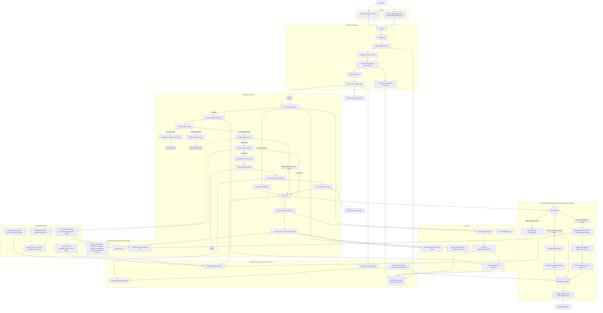

# Propqa architecture

Propqa is a conversational agent for the Dubai and UAE property market. A FastAPI app streams each chat turn over server-sent events. A single LangGraph workflow decides whether the turn needs stored data, loads only the relevant catalog packs, and answers from a read-only warehouse.

This file follows the running app under `src/`. The standalone diagram is [complete-architecture.mermaid](complete-architecture.mermaid). Files under `table schema/Diagrams/` describe an older multi-agent pipeline.

## Diagram

Dotted edges are techniques used inside a node. Solid edges are the graph and the data path.

## Workflow

The graph is built in `src/agent/graph/workflow.py`. `POST /api/chat` calls `stream_turn`, which runs that graph and forwards custom stream events to the browser.

1. **HTTP.** Middleware is raw ASGI so the SSE body is not buffered. Order is CORS, request id, optional JWT, caller (signed-in user or visitor), then rate limit. An invalid token leaves the caller as a visitor. The limiter fails open when Redis is down.
2. **Session context.** `load_session_context` reads Redis working memory: the search frame, goal, and cached profile. The checkpoint thread id is the chat session id.
3. **Focused listings.** If the UI sent listing ids the user picked on screen, the turn loads those adverts and goes straight to `write_reply`. Routing and warehouse lookup are skipped.
4. **Recall and forget.** Otherwise the turn recalls long-term memories. A forget request interrupts the graph and asks for confirmation before a soft delete. That branch ends at the interrupt.
5. **Parallel frame and route.** When the turn continues, `choose_query_route` and `update_search_frame` run together. Neither reads the other's output. The frame branch ends on its own. The route branch carries the turn.
6. **Query route.** The structured query router sets one of `direct_answer`, `need_db`, or `out_of_scope`, plus turn kind, intent, and listing filters. Direct answers and out-of-scope turns go to `write_reply`.
7. **Domain route.** Only `need_db` continues. A refine turn reuses the previous domain ids. Any other turn picks catalog packs. Empty packs go to `write_reply` with an unavailable answer.
8. **Lookup path.** `personalize_search_frame` applies saved preferences, `load_domain_catalog` renders only the chosen YAML, `resolve_mentioned_names` grounds places and listing requirements, and `run_warehouse_lookup` runs one of the three SQL techniques below.
9. **Reply.** `write_reply` streams the answer. Listing ids become cards and an SSE `listings` event before the prose. Out of scope uses fixed text. Direct answers and lookup answers prefer a structured JSON reply.
10. **Close.** `queue_memory_extraction` pushes the turn onto Redis `memq`. `record_search_and_clear_turn_state` saves working memory, keeps `last_need_db` for the next refine, and drops catalog text, grounding, and listing payloads from the checkpoint.

The memory worker (`python -m agent.memory.worker`) drains `memq` and writes long-term memories to chat Postgres. Chat still runs if the worker is stopped; those memories stay on the queue.

## Techniques

### LangGraph

`StateGraph` in `src/agent/graph/workflow.py` holds `ChatState`, with conditional edges, one parallel branch, and `interrupt()` for forget confirmation. The compiled graph uses a Redis checkpointer (24-hour TTL) and, outside tests, a Postgres long-term store. Each node logs its own duration.

### Server-sent events

Chat transport is `POST /api/chat`. Events are `text`, `listings`, `reply`, `error`, and `done`. Health reports `hitl_transport: sse` and `ws_mounted: false`. The React app in `Frontend_Gerenal` reads the stream in `src/api/sseClient.ts`.

### Two-stage routing

The query router (`src/agent/prompts/query_router.py`, `choose_query_route`) sees recent history, the last database turn, short domain blurbs, recalled memory, and the property-type list. It returns a strict JSON route. `sanitize_query_route` drops weak names and repairs a refine that has no prior lookup.

The domain router then chooses packs from `src/catalog/domains/index.yaml`:

| Pack | What it answers |
| --- | --- |
| listings | Live asking-price listings, units, and building profiles |
| transactions | DLD sales, registered rents, and valuations |
| locations | Communities, the location tree, and the usual place join |
| developers | Off-plan projects, handover, permits, and who is building |
| schools | KHDA schools, nurseries, and universities |
| rta | Metro, tram, bus, parking, Salik, and roads |
| amenities | Parks, healthcare, and building facilities |
| agencies | Brokers, agencies, and owners associations |
| regulations | Service charges and DLD procedures |
| market | Price indices, community averages, and rental yields |

`sanitize_domain_route` caps how many packs load and drops unknown ids.

### Jev parallel judgments

When `DOMAIN_ROUTER` is not `llm`, `src/agent/services/jev_domain_router.py` sends one request that scores several questions at once:

- **lead** — which pack holds the main fact
- **combines** — whether the message joins two subjects
- **subject** — one score per pack, used only when combines is high enough to add a second pack
- **place** — whether the lookup is limited to a named place, which adds the `locations` join
- **recipe** — which fixed lookup matches the whole question

A recipe is taken only at high confidence, because it skips SQL drafting. If Jev is unconfigured or raises `TypeSafeError`, the same node falls back to a structured LLM `DomainRoute`.

### Catalog-scoped text-to-SQL

The model that writes SQL sees the chosen domain YAML and profile notes, not the whole warehouse. Place-limited questions join through `locations`. Fixed lookups live in `src/catalog/recipes.yaml` and bind only when grounding supplies every parameter.

### Three SQL techniques

`src/agent/sql/lookup.py` picks the path inside `run_warehouse_lookup`:

- **Code-built listing search.** When intent is `LIST` or `RANK` and the query router produced listing filters, `search_listings` writes the SQL. If nothing matches, a relaxation waterfall widens price, size, bedrooms, furnishing, completion, and station distance, and the reply notes what was relaxed.
- **Recipes.** A confident `recipe_id` whose parameters bind runs that fixed `SELECT` and skips the draft.
- **Draft plus guard.** Otherwise the model drafts one statement. `prepare_select` in `src/agent/sql/guard.py` uses sqlglot to allow a single read against the loaded tables, enforce the row cap, and reject blended averages that break the segment rules. The lookup retries once when the statement fails or returns no usable rows.

Listing ids from any path are filled into cards once, for the sidebar and the answer.

### Grounding

On startup, `get_grounding_cache().load_in_background()` builds an in-process index of places, stored names, and listing features from the warehouse. `resolve_mentioned_names` matches the names and requirements the router found, limited to tables in the loaded packs. The first turn waits briefly for that index. Later refreshes keep serving the previous copy. Unmatched names are still searched as text.

### Memory

| Store | Holds |
| --- | --- |
| Redis checkpoint | Graph state for the session, trimmed at the end of the turn |
| Redis `wm:{thread_id}` | Search frame and goal across turns |
| Redis `profile:{user_id}` | Cached user profile |
| Redis `memq` | Extraction jobs for the worker |
| Chat Postgres + pgvector | Users, refresh tokens, and long-term memories |

Recall ranks memories for the current user and injects a short block into routing and the reply. Personalization applies saved defaults on the database path. Extraction rejects content the safety rules say never to store. Forgetting is a confirmed soft delete, not a silent wipe.

### Reply

`write_reply` chooses the answer shape:

- Focused listings: a structured reply from those adverts, or a fixed message when they cannot be loaded.
- Out of scope: fixed text, with no model call.
- Direct answer: structured reply, with a prose stream as fallback.
- Database turn with no domains, an empty result, or a failed lookup: a fixed unavailable or empty message.
- A successful lookup: structured JSON (intro, figures, map pins, building pages), streamed as `reply`, with data-source notes.

A short memory disclosure or the next buyer-profile question can be appended on the same turn.

### Models, tracing, and databases

`LLM_PROVIDER` selects Anthropic or OpenAI. Router, answer, and SQL calls use strict JSON schemas, and a failed parse retries once onto a safe fallback route or reply. Langfuse receives the run when its keys are set.

Warehouse Postgres (`AUDIT_DB_*`) is read-only market data for SQL, cards, contacts, and the grounding index. Chat Postgres (`CHAT_DB_*`) holds users, refresh tokens, and long-term memory. Those chat tables are created on first use. Redis also holds sidebar sessions, UI preferences, and rate-limit counters.

Golden checks live in `src/evals/`: domain-router accuracy and end-to-end SQL against the warehouse.

## Related diagrams

| File | What it adds |
| --- | --- |
| [01-runtime.mermaid](01-runtime.mermaid) | Dev server, Docker nginx, API process, and external services |
| [02-frontend.mermaid](02-frontend.mermaid) | Chat shell, dashboard tabs, and which API calls the UI makes |
| [03-backend-http.mermaid](03-backend-http.mermaid) | Mounted routes and frontend calls that have no backend route |
| [04-chat-graph.mermaid](04-chat-graph.mermaid) | The same graph nodes, without the lookup and routing techniques |
| [05-data.mermaid](05-data.mermaid) | Redis keys, chat tables, warehouse readers, and catalog YAML |
