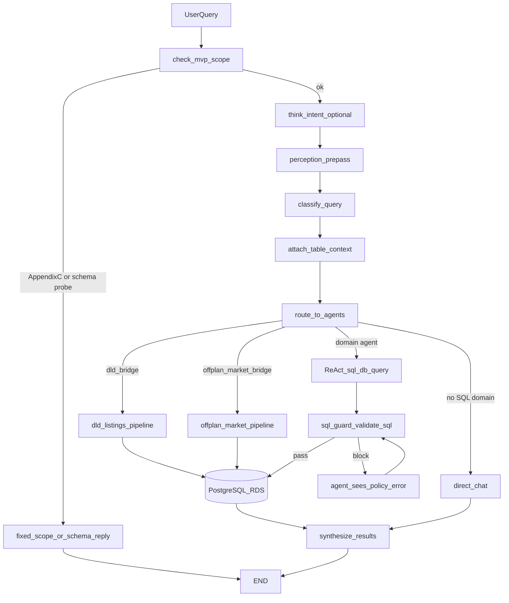
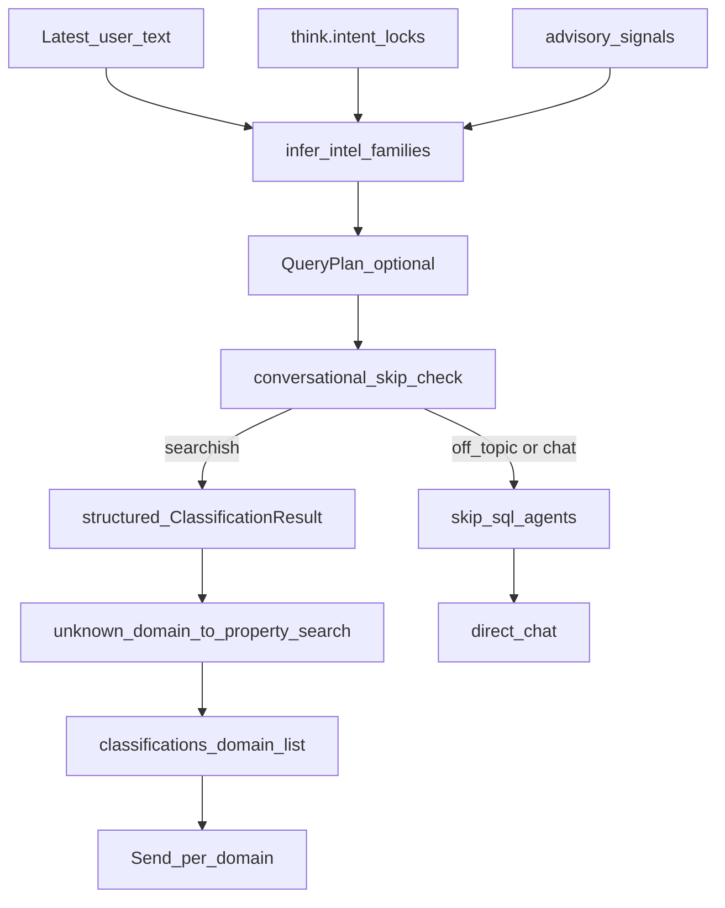
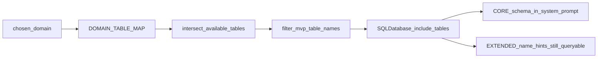
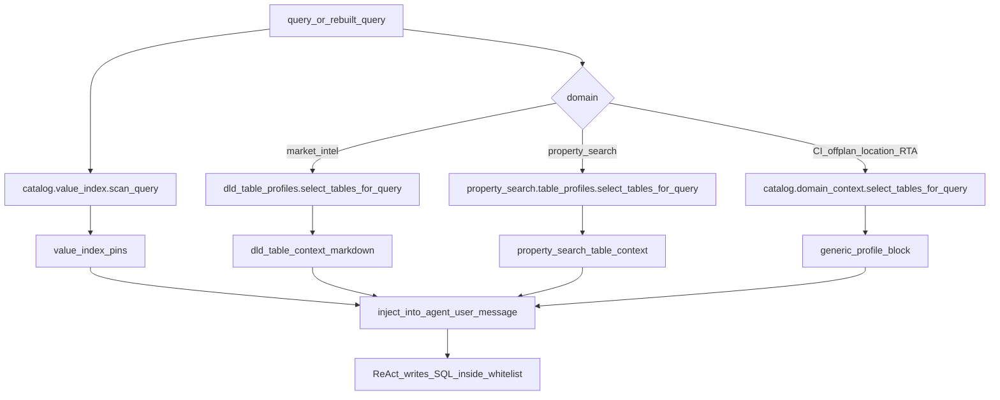

# Table routing (query → PostgreSQL tables)

How a user chat turn is mapped onto **specific RDS tables**. This is table targeting, not the domain fan-out overview in [[routing-and-flow]].

> [!important] No `table_router` module
> A query never maps 1:1 to “the table.” Routing is two-stage: **query → domain(s)**, then **domain → table subset**. Runtime selectors **steer** the ReAct agent; they do not change `SQLDatabase(include_tables=...)`.

Related diagrams:

- [diagrams/table-routing.mermaid](diagrams/table-routing.mermaid) — combined four-layer view (all domains)
- [Property_Search/property-search-table-routing.mermaid](Property_Search/property-search-table-routing.mermaid) — listings cue → table hints + FilterSpec joins
- [Property_Search/property_search.md](Property_Search/property_search.md) — `property_search` persona pack
- [diagrams/sql-router-fanout.mermaid](diagrams/sql-router-fanout.mermaid) — domain `Send` fan-out
- [diagrams/domain-agent-factory.mermaid](diagrams/domain-agent-factory.mermaid) — startup whitelist bake
- [diagrams/classification-waterfall.mermaid](diagrams/classification-waterfall.mermaid) — query → domain

Not on this path:

- [`Backend/retrieval/hybrid_retriever.py`](../../Backend/retrieval/hybrid_retriever.py) is a stub (`return []`)
- Manticore env keys exist; **no code** uses Manticore to pick Postgres tables

---

## Four layers

```
Layer 0  Scope gate          check_mvp_scope / Appendix C / schema probe
Layer 1  Query → domain(s)   infer_intel_families + Think locks + LLM classifier
Layer 2  Hard whitelist      DOMAIN_TABLE_MAP ∩ available_tables → include_tables
Layer 3  Runtime hints       regex / value-index profile blocks in the user message
Layer 4  SQL execution guard sql_guard + adaptive recovery
```

Copy-paste mermaid for each layer lives in [diagrams/table-routing.mermaid](diagrams/table-routing.mermaid). Focused views:

### End-to-end



---

## Layer 1 — Query → domain

**Files:**

- [`Backend/query_classifier.py`](../../Backend/query_classifier.py) — `infer_intel_families`, `classify_query`
- [`Backend/orchestration/perception_prepass.py`](../../Backend/orchestration/perception_prepass.py)
- [`Backend/advisory_signals.py`](../../Backend/advisory_signals.py)
- [`Backend/agent.py`](../../Backend/agent.py) — `route_to_agents`



`infer_intel_families` reads the **latest message only**. Order is most-specific first: communities → market → offplan → location → RTA → listings.

| Cue | Typical domain |
|---|---|
| Community-page / lifestyle / schools narrative | `communities_intel` |
| Market / DLD aggregate / valuation Think lock | `market_intel` |
| Off-plan catalog (brochure / payment plan / handover) | `offplan_projects` |
| Area ranking / neighbourhood narrative | `location_intel` |
| Metro / bus / Salik / parking (flag on) | `rta_intel` |
| Listing inventory nouns + AED / beds | `property_search` |
| Listing **count** + market volume | `property_search` + `market_intel` |
| Advisory / ROI / allocation | companion domains from `advisory_signals` (no dedicated advisory SQL agent) |

Think locks (`think.intent`): `market_intel` / `valuation`, `communities_intel`, `offplan_projects`, `rta_intel`, persona aliases (`investor_intelligence`, `buyer_fit`, `rental_intel`).

**LLM classifier** (`_allowed_domains()`): six ReAct domains + bridges (`dld_bridge`, `offplan_market_bridge`, mobility bridges) + YAML profiles when `PROFILE_REGISTRY=1`. Unknown domain is coerced to **`property_search`**. Classifier/planner outage sets `skip_sql_agents=True` (honest chat, no invented domain).

> [!note] `_try_fast_classify` is retired
> The regex keyword ladder in [`query_classifier.py`](../../Backend/query_classifier.py) always returns `None`. Domain routing is LLM-only (perception / planner / structured classifier). Do not treat the old area+keyword short-circuit as live. See [classification-waterfall.mermaid](diagrams/classification-waterfall.mermaid).

**Special routes** — Python SQL, not ReAct table picking:

| Classification | Node | Tables |
|---|---|---|
| `dld_bridge` | `dld_listings_pipeline` via [`dld_join_chain.py`](../../Backend/dld_join_chain.py) | `real_estate_dld_transactions`, `real_estate_dld_rent_contracts`, `dld_community_avg_sale_price`, `locations`, `properties`, `users` |
| `offplan_market_bridge` | `offplan_market_pipeline` via [`offplan_market_bridge.py`](../../Backend/offplan_market_bridge.py) | DLD sales + `offplan_projects` |

LLM agents must **not** JOIN DLD ↔ `properties`. That path is orchestrator-only (`DLD_JOIN_CHAIN_ALLOWED_TABLES`).

---

## Layer 2 — Domain → hard table whitelist

**Files:**

- [`Backend/domain_agents.py`](../../Backend/domain_agents.py) — `DOMAIN_TABLE_MAP`, `DOMAIN_CORE_TABLE_MAP`, `_build_single_agent`
- [`Backend/mvp_scope_guard.py`](../../Backend/mvp_scope_guard.py) — `filter_mvp_table_names`, `MARKET_INTEL_DLD_ALLOWED`
- [`Backend/agent.py`](../../Backend/agent.py) — startup reflect + `build_domain_agents`



Startup (once per process):

1. `available = SQLDatabase(engine).get_usable_table_names()`
2. `target_tables = filter_mvp_table_names([t for t in DOMAIN_TABLE_MAP[domain] if t in available])`
3. `SQLDatabase(engine, include_tables=target_tables, sample_rows_in_table_info=0)`
4. CORE tables get `col:type` in the system prompt; EXTENDED tables are name-only hints but remain queryable
5. Production `build_domain_agents` **excludes** `rta_intel` and `communities_intel` (those use staging `AUDIT_DB_*`)

Unqualified names resolve via `DB_SEARCH_PATH` (default `public,ai_chatbot`) on the SQLAlchemy connect options.

### Hard bans

- Appendix-C private / auth / log / session tables — never in any agent
- Any identifier containing `dld` **unless** it is in `MARKET_INTEL_DLD_ALLOWED`:
  - `real_estate_dld_transactions`
  - `real_estate_dld_rent_contracts`
  - `real_estate_dld_areas`
  - `dld_community_avg_sale_price`
  - `real_estate_dld_projects`
  - `real_estate_dld_buildings`
  - `real_estate_dld_developers`
  - `real_estate_dld_units`
  - `real_estate_dld_land_registry`
- `DLD_JOIN_CHAIN_ALLOWED_TABLES` is orchestrator-only

### Domain inventory

Production engine (`DB_*`) unless noted.

| Domain | Engine | CORE (schema baked) | EXTENDED / notes |
|---|---|---|---|
| `property_search` | production | `properties`, `locations_v2`, `locations`, amenities/views/categories bridges, nearby, files, leads, favorites, users, subscriptions | engagement / bulk-import / plans / countries |
| `location_intel` | production | `locations`, `buildings`, NLP search tables, nearby, `pf_locations`, `places` | PostGIS metadata, `bayut_locations`, `countries`. **No** editorial community pages |
| `market_intel` | production | DLD transactions / rent / areas / avg, projects / buildings / developers, `price_trend_*`, `rental_contract_summary`, `locations` | `real_estate_dld_units`, `real_estate_dld_land_registry` |
| `offplan_projects` | production | `offplan_projects`, `offplan_files`, `locations` | — |
| `communities_intel` | staging `AUDIT_DB_*` | default `area_insights_communities` | matviews `public.mv_community_*` are not reflectable; FQNs live in the prompt via `communities_page_schema`. `COMMUNITIES_AREA_INSIGHTS=0` restores legacy `ps_*` |
| `rta_intel` | staging `AUDIT_DB_*` | metro / tram / bus / marine / Salik / parking / monthly trips (~24) | ridership / fleet / roads (~15). Gated by `RTA_INTEL_ENABLED=1` |

YAML sub-agents ([`Backend/orchestration/profiles/`](../../Backend/orchestration/profiles/)):

- `comparator` — `properties`, `locations`, `categories`, `amenities`, `views`
- `research` — profile `allow_tables`
- `policy_advisor` — `allow_tables: []` (no SQL)

---

## Layer 3 — Runtime table targeting (hints)

After classify, [`query_classifier.py`](../../Backend/query_classifier.py) attaches context (`_attach_dld_table_context`, `_attach_property_search_table_context`, `_attach_value_index_pins`). [`agent.py`](../../Backend/agent.py) `_make_agent_node` injects the blocks into the **user message**. These hints do **not** shrink `include_tables`.



### `market_intel` regex

[`Backend/market_intel/dld_table_profiles.py`](../../Backend/market_intel/dld_table_profiles.py) — `select_tables_for_query`, cap `DLD_CONTEXT_MAX_TABLES` (default 3). Short aliases expand to full names (`transactions` → `real_estate_dld_transactions`).

| Query cue | Selected tables |
|---|---|
| yield / ROI | rent_contracts + transactions + areas |
| rent / Ejari | rent_contracts + areas |
| avg price (no sale cue) | community_avg + areas |
| developer / project registry | projects + developers + areas |
| rent trend | `price_trend_rent_fact` + areas |
| buy trend | `price_trend_buy_fact` + areas |
| sale / valuation intent | transactions + areas |
| else (default bundle) | transactions + rent_contracts + areas |

### `property_search` regex

[`Backend/property_search/table_profiles.py`](../../Backend/property_search/table_profiles.py) — cap `PROPERTY_SEARCH_CONTEXT_MAX_TABLES` (default 6). Always includes `properties` + `locations_v2` + categories; extends on view / nearby / amenity cues.

Listings also have a **deterministic FilterSpec path** (`run_property_search`) that JOINs the same tables from SQL, not from ReAct hints. Full cue table, join contract, and dual-executor notes: [[property_search]].

### Generic domains (value index)

`GENERIC_PROFILE_DOMAINS` = `communities_intel`, `offplan_projects`, `location_intel`, `rta_intel`.

[`Backend/catalog/domain_context.py`](../../Backend/catalog/domain_context.py) scores tables by value-index phrase hits. No hits → largest tables by `approx_rows`. Example: `"Red Line"` pins `rta_intel.metro_lines`.

### Value-index pins (all six domains)

[`Backend/catalog/value_index.py`](../../Backend/catalog/value_index.py) + [`Backend/catalog/resolution.py`](../../Backend/catalog/resolution.py): n-gram lookup phrase → `(domain, table, column)`. Injected as:

```
[resolved] Dubai Marina is stored in `locations.name`
```

Evidence, not authority — a pin does not override the classifier domain.

Offline profile JSON: [`Backend/data/table_profiles/`](../../Backend/data/table_profiles/) generated by [`Backend/scripts/build_table_profiles.py`](../../Backend/scripts/build_table_profiles.py). Missing artifacts → empty hint; the agent falls back to the pre-baked CORE schema.

---

## Layer 4 — SQL execution guard

[`Backend/sql_guard.py`](../../Backend/sql_guard.py) wraps `sql_db_query`:

- Block DML / DDL, multi-statement, Appendix-C table names
- Inject `LIMIT` / adaptive empty-result recovery ([`Backend/adaptive_sql_recovery.py`](../../Backend/adaptive_sql_recovery.py))
- YAML `permissions.sql.allow_tables` for profile sub-agents ([`Backend/orchestration/tools/sql_query.py`](../../Backend/orchestration/tools/sql_query.py))

The ReAct agent can only emit SQL against tables already in `include_tables`. The guard is a second fence, not the router.

---

## Worked example

Query: *What's the average sale price in Dubai Marina last year, and show 2-bed listings under 2M?*

1. Families: `market_intel` (avg / sale) + `property_search` (2-bed listings + AED)
2. Fan-out: two `Send`s
3. `market_intel` hints: `real_estate_dld_transactions` + `real_estate_dld_areas`
4. `property_search` hints: `properties` + `locations_v2` + categories
5. Value index may pin `locations` / `locations_v2` for “Dubai Marina”
6. Each agent runs SQL only on its whitelist; synthesizer merges markdown + listing cards

---

## Fallbacks

| Failure | Behaviour |
|---|---|
| Unknown classifier domain | Coerced to `property_search` |
| No tables in DB for a domain | `_build_single_agent` returns `None`; `route_to_agents` skips it |
| Table blocked by MVP guard | Dropped by `filter_mvp_table_names` |
| LLM classifier / planner outage | `skip_sql_agents=True` → `direct_chat` |
| Schema / infra probe | Fixed `schema_guard_reply` — no agents |
| Appendix-C in generated SQL | `validate_sql` returns a policy message; SQL is not executed |
| Empty / failed SQL | `adaptive_sql_recovery` + date-window widening |
| Profile artifacts missing | Empty hint; CORE schema in the system prompt still applies |
| Value index unavailable | No pins injected |
| Generic domain, no value hits | Largest tables by `approx_rows` |
| `market_intel` regex no match | Default bundle: transactions + rent_contracts + areas |
| `rta_intel` disabled | Removed from `_allowed_domains()` |
| `hybrid_retriever` | Always `[]` (stub) |

---

## Env knobs that change targeting

| Flag | Effect |
|---|---|
| `DB_SEARCH_PATH` | Schema resolution (default `public,ai_chatbot`) |
| `RTA_INTEL_ENABLED` | Register `rta_intel` |
| `COMMUNITIES_AREA_INSIGHTS` | Page tables vs legacy `ps_*` |
| `DLD_CONTEXT_*` | market_intel hint budget / enable |
| `PROPERTY_SEARCH_CONTEXT_*` | listing hint budget / enable |
| `DOMAIN_CONTEXT_*` | generic-domain hint budget |
| `PROFILE_REGISTRY` | YAML sub-agents with their own `allow_tables` |
| `CLASSIFIER_MODEL` | Domain classification model |

---

## Canonical code

| Concern | Path |
|---|---|
| Domain → table map | [`Backend/domain_agents.py`](../../Backend/domain_agents.py) |
| Query → domain | [`Backend/query_classifier.py`](../../Backend/query_classifier.py) |
| Fan-out + hint inject | [`Backend/agent.py`](../../Backend/agent.py) |
| MVP / DLD allow | [`Backend/mvp_scope_guard.py`](../../Backend/mvp_scope_guard.py) |
| DLD table hints | [`Backend/market_intel/dld_table_profiles.py`](../../Backend/market_intel/dld_table_profiles.py) |
| Listing table hints | [`Backend/property_search/table_profiles.py`](../../Backend/property_search/table_profiles.py) |
| Value-index hints | [`Backend/catalog/domain_context.py`](../../Backend/catalog/domain_context.py), [`Backend/catalog/resolution.py`](../../Backend/catalog/resolution.py) |
| SQL fence | [`Backend/sql_guard.py`](../../Backend/sql_guard.py) |

---

## Related docs

- [[routing-and-flow]] — domain fan-out, synthesis, persona aliases
- [[architecture]] — three-layer intel stack
- [[registration-and-config]] — registries and env flags
- [[dld_bridge]] — orchestrator join chain
- [[property_search]] — listings persona, FilterSpec SQL, cue → table hints
