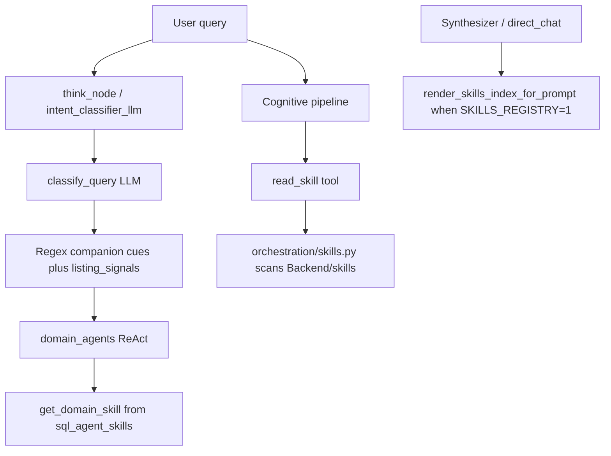

# Keywords, Regex, System Prompts, and Skills Inventory

Inventory of **named regex patterns**, **keyword lists**, **system-prompt constants**, and **skills** used in PropQA. Patterns are quoted from source as of this document. Novel-length prompt/skill bodies are **not** dumped in full — names, consumers, and keyword excerpts are listed instead.

## 1. Purpose and architecture

Domain routing is **Haiku LLM-first**:

1. Honor cognitive `think.intent` locks (e.g. `market_intel`, `communities_intel`).
2. LLM query planner (`QueryPlan`).
3. Conversational Haiku intent (skip SQL).
4. Structured classifier LLM.
5. On total LLM outage: honest `skip_sql_agents` (never invent a domain).

The legacy regex ladder `_try_fast_classify()` in [`Backend/query_classifier.py`](../Backend/query_classifier.py) is **retired and always returns `None`**. Regex still drives:

- quality-gate / off-topic / unintelligible detection
- FilterSpec slot extraction
- listing vs RTA / DLD guards
- companion-intel fan-out and think-locks
- table-profile hints
- mobility / readiness bridges
- persona fallback when LLM persona is null
- schema / injection / SQL / public-mode guards
- answer completeness and output scrubbing

`_DUBAI_AREAS_RE` / `_DEVELOPERS_RE` exist in three families (classifier, quality gate, property_filters) with slightly different membership. All three are quoted below.

---

## 2. Regex and keyword catalog


### Classification and companion-intel cues

Source: [`Backend/query_classifier.py`](../Backend/query_classifier.py)

#### `_THINK_MARKET_LOCK_INTENTS`

Kind: list

```
'market_intel', 'valuation'
```

#### `_THINK_COMMUNITIES_LOCK_INTENTS`

Kind: list

```
'communities_intel'
```

#### `_THINK_LOCATION_LOCK_INTENTS`

Kind: list

```
'location_intel'
```

#### `_COMMUNITIES_NEIGHBOURHOODS_NEAR_RE`

Kind: regex

```
\b(?:which|what)\s+neighbou?rhoods?\s+(?:are\s+)?near\b|\b(?:nearby\s+)?neighbou?rhoods?\s+near\b|\bneighbou?rhoods?\s+(?:around|close\s+to)\b
```

#### `_COMMUNITIES_SALVAGE_RE`

Kind: regex

```
(?:\bsub-?communit(?:y|ies)\b|\bparent\b.{0,40}\bcommunit|\bdrive\s+from\b|\bhow\s+long\s+does\s+it\s+take\s+(?:to\s+drive)?\b|\bwhat(?:'s|\s+is|\s+are)\s+.{1,80}?\s+like\b|\btell\s+me\s+(?:something\s+|more\s+)?about\b|\bgive\s+me\s+(?:an?\s+)?(?:overview|summary|intro|rundown)\s+(?:of|on)\b|\boverview\s+(?:of|on)\b|\b(?:info(?:rmation)?|more\s+(?:info|information|details))\s+(?:on|about)\b|\banything\s+(?:i\s+should\s+know\s+)?about\b|\bcommunit(?:y|ies)\s+in\b|\bliving\s+in\b|\blife\s+in\b|\bmoving\s+to\b|\bfamily[- ]friendly\b|\bwho\s+lives\s+(?:here|in)\b|\bbest\s+communit|\bwhere\s+should\s+i\s+(?:live|rent|buy)\b|\bwhich\s+(?:area|communit|neighbou?rhood))
```

#### `_COMMUNITIES_FAMILY_CUE_RE`

Kind: regex

```
\b(?:amenities|lifestyle|schools?|famil(?:y|ies)|neighbou?rhoods?|commute|things\s+to\s+do|who\s+lives\s+(?:here|in)|nationalit|family[- ]friendly|nurser(?:y|ies)|healthcare|khda|vibe|atmosphere|walkable|demographics?|expats?|communit(?:y|ies)|living\s+in|life\s+in|tell\s+me\s+(?:something\s+|more\s+)?about|overview\s+(?:of|on))\b
```

#### `_DLD_AGGREGATE_RE`

Kind: regex

```
\b(?:dld|yields?|roi|transactions?|cap\s*rate|price\s+per\s+sq|average\s+transaction|yoy|year[- ]over[- ]year)\b
```

#### `_THINK_PERSONA_LOCK_INTENTS`

Kind: list

```
'investor_intelligence', 'buyer_fit', 'rental_intel'
```

#### `_THINK_RTA_LOCK_INTENTS`

Kind: list

```
'rta_intel'
```

#### `_THINK_OFFPLAN_LOCK_INTENTS`

Kind: list

```
'offplan_projects'
```

#### `_PROPERTY_RE`

Kind: regex

```
\b(apartments?|villas?|townhouses?|penthouse|listing|listings|for sale|for rent|(?:buy|rent)\s+(?:an?\s+)?(?:apartments?|villas?|townhouses?|penthouse|studio|flat|unit|property|properties|home|house|place|listing|listings|in\b|near\b|under\b|below\b|above\b|over\b)|bedroom|bed\b|bath\b|bathrooms?|rooms?\b|furnished|semi.furnished|unfurnished|sea view|city view|garden view|marina view|price range|cheapest|most expensive|studio|freehold|free.hold|leasehold|lease.hold|visa|tenure|distress(?:ed)?|below market|corner unit|corner\b|layout.?type|duplex|weekly rent|daily rent|monthly rent|yearly rent|annual rent|off.?plan|ready to move|completion|handover|amenities|amenity|pool|gym|balcony|parking|nearby|near\b|rental period|short.?term|factory|factories|warehouse|labour.?camp|industrial.?land|commercial.?plot|showroom|most.?favour(?:ite|ited)|most.?viewed|trending.?propert|viewing.?request|enquir(?:y|ies)\s+(?:on|about|for)|leads?\s+on|most.?popular.?(?:listing|propert)|most.?enqu(?:ired|iry))\b
```

#### `_OFFPLAN_RE`

Kind: regex

```
\b(off[\s-]?plan|handover|payment plans?|developers?|completion date|under construction|new build)\b
```

#### `_MARKET_RE`

Kind: regex

```
\b(transaction|trend|forecast|rental summary|rental contract|ejari|mortgages?\s+transaction|mortgage\s+volume|gift\s+transaction|gifts?\s+transaction|alpha[\s.]?beta|DLD|dld\b|price per\s+(sq|square)\s?(m|meter|metre|ft|foot|sqft)|meter\s+sale\s+price|meter\s+rent\s+price|market\s+(data|intel|stats|statistics)|average\s+(sale\s+|rental\s+|annual\s+|contract\s+)?price|median\s+price|avg\s+price|community\s+average|actual\s+worth|price\s+per\s+sqft|price\s+appreciation|transaction\s+(volume|count|split)|how\s+many\s+\w+\s+(transactions?|contracts?|ejari)|number\s+of\s+(recorded\s+)?sales|total\s+(transaction|contract)\s+(count|volume)|rental\s+contract\s+volume|rental\s+contract\s+average|industrial\s+(rental|contract|ejari)|multi.?usage\s+(rental|contract|ejari)|storage\s+(rental|contract|ejari)|residential\s+(ejari|rental\s+contract)|commercial\s+(ejari|rental\s+contract)|sales?\s+vs\.?\s+(mortgage|rental)|sale\s+vs\s+rent|year[\s-]over[\s-]year|yoy\b|quarterly\s+trend|annual\s+growth|price\s+trend|monthly\s+rental\s+trend|when\s+did\s+prices\s+peak|have\s+\w+\s+prices\s+(increased|decreased|changed)|top\s+\d*\s*areas?\s+by|most\s+active\s+(area|community|dld)|rental\s+yield|gross\s+yield|market\s+(summary|report|activity)|dld\s+market\s+intelligence|dld\s+transaction\s+data|most\s+transacted|highest\s+average|lowest\s+average|\broi\b|return\s+on\s+investment|best\s+roi|highest\s+roi|investment\s+(yield|return|performance)|which\s+(area|project|community)\s+has\s+(best|better|highest)\s+(roi|yield|return))\b
```

#### `_LOCATION_RE`

Kind: regex

```
\b(community info|neighbourhood|neighborhood|POI|nearby|building info|area info|what is .+ like|tell me about .+ area|schools near|hospitals near|describe .+ community)\b
```

#### `_SKIP_SQL_RE`

Kind: regex

```
^(hi|hello|hey|thanks|thank you|bye|goodbye|what can you do|who are you|what is my name|my name is)\b
```

#### `_HUMAN_AGENT_RE`

Kind: regex

```
\bagent\s+with\b|\b(?:agent|broker|specialist|consultant|advisor)\b\s+.{0,50}\b(?:\d+\s*(?:\+\s*)?\s*years?|experience)|\bconnect\s+(?:me\s+)?with\s+(?:an?\s+)?(?:[a-z]+[\s-]?){0,3}(?:agent|broker|specialist|advisor|consultant)\b|\bconnect\s+me\s+with\s+them\b|\bfind\s+(?:me\s+)?(?:an?\s+)?(?:agent|broker|specialist)\b|\brecommend\s+(?:an?\s+)?(?:agent|broker)\b
```

#### `_AGENT_LANGUAGE_MENTION_RE`

Kind: regex

```
\b[a-z]+[\s-]speaking\s+(?:agent|broker|specialist|consultant|advisor)\b
```

#### `_PROGRAMMING_JARGON_RE`

Kind: regex

```
\b(python|javascript|typescript|programming\s+language|source\s+code|write\s+(?:a\s+|some\s+)?(?:function|script|program|code)|algorithm|data\s+structure|for\s+loop|while\s+loop|regular\s+expression|regex|json\s+parsing)\b
```

#### `_AREA_RANKING_RE`

Kind: regex

```
\bwhich\s+(?:area|areas|community|communities|location|locations|neighbou?rhood|neighbou?rhoods)\b[^?.!]{0,60}\b(?:most|highest|greatest|largest|maximum|least|fewest|lowest)\b|\b(?:most|highest|greatest|largest)\b[^?.!]{0,40}\b(?:area|areas|community|communities|location|locations)\b[^?.!]{0,20}\bhave\b|\bwhere\s+are\s+(?:the\s+)?most\b|\btop\s+(?:communit(?:y|ies)|areas?|locations?)\s+(?:for|with|by)\b
```

#### `_ALTERNATIVES_RE`

Kind: regex

```
\b(?:do\s+you\s+have|have\s+you\s+got|is\s+there|are\s+there|got\s+(?:any|some)|any)\b.{0,40}\b(?:alternative|other|different|more|another|extra)\b.{0,40}\b(?:propert(?:y|ies)|option|options|choice|choices|result|results|listing|listings|unit|units)\b|\b(?:show\s+(?:me\s+)?(?:the\s+)?)?(?:alternative|other|different)\b.{0,40}\b(?:propert(?:y|ies)|option|options|listing|listings)\b|\bno\s+(?:other|more|alternative)\s+(?:option|options|propert|choice)\b|\bwider\s+(?:search|options?|results?)\b
```

#### `_FILTER_RECALL_RE`

Kind: regex

```
(?:^|\b)((?:what(?:'s|\s+(?:was|were|is|are))?)\s+(?:my|the)\s+(?:(?:current|previous|prior|last|earlier|old|saved|active|running|set|chosen|selected)\s+)?(?:price|prices|budget|buget|bedroom|bedrooms|bed\s+count|beds|bathroom|bathrooms|baths|location|area|address|zone|community|neighbou?rhood|filter|filters|search|criteria|preference|preferences|property\s+type|type|developer|developers)|what\s+(?:filters?|criteria|preferences?|search(?:es)?)\s+(?:do|did)\s+i\s+(?:have|set|ask|use|specify)|what\s+(?:bedroom|location|area|address|price|budget|type)\s+(?:did|do)\s+i\s+|(?:do\s+you\s+remember|do\s+you\s+recall|remember)\s+(?:my|the)\s+(?:price|budget|filter|filters|bedroom|location|area|address|preference)|remind\s+me\s+(?:of|about)\s+(?:my|the)\s+(?:price|budget|filter|filters|preference|search|criteria)|show\s+me\s+my\s+(?:current\s+)?(?:filters?|criteria|preferences?|price|budget|search)|what\s+was\s+i\s+(?:searching|looking)\s+for|what\s+am\s+i\s+(?:searching|looking)\s+for)\b
```

#### `_DUBAI_AREAS_RE`

Kind: regex

```
\b(dubai marina|marsa dubai|marina walk|marina|downtown dubai|downtown|burj khalifa|business bay|bay square|palm jumeirah|the palm|palm deira|palm jebel ali|jumeirah village circle|jvc|jumeirah village triangle|jvt|jumeirah lake towers|jlt|jumeirah beach residence|jbr|jumeirah|dubai hills|dubai hills estate|arabian ranches|mirdif|meadows|springs|lakes|emirates hills|mudon|town square|reem|arabian ranches 2|arabian ranches 3|damac hills|damac hills 2|akoya|tilal al ghaf|dubailand|motor city|sports city|studio city|al nahda|al barsha|al qusais|al warqa|al khail|silicon oasis|academic city|international city|festival city|mirdiff|nad al sheba|bluewaters|city walk|port de la mer|la mer|dubai creek harbour|creek harbour|creek|ras al khor|dubai south|expo city|expo|meydan|nad al hammar|warsan|al furjan|discovery gardens|jebel ali|the greens|the views|barsha heights|tecom|media city|internet city|knowledge village|deira|bur dubai|satwa|karama|oud metha|mbr city|mohammed bin rashid city|majan|liwan)\b
```

#### `_DEVELOPERS_RE`

Kind: regex

```
\b(emaar|damac|binghatti|nakheel|sobha|azizi|danube|meraas|dubai properties|ellington|select group|omniyat|tiger|deyaar|union properties|aldar|arada|wasl|mag|dubai holding|nshama|mbr|bloom|reportage|prescott|swank|lmd|samana|object 1|peace homes)\b
```

#### `_PRICE_TYPE_RE`

Kind: regex

```
\b\d+(?:[.,]\d+)?\s*(?:m|million|k|thousand|aed)\b.*?\b(apartment|apartments|villa|villas|townhouse|penthouse|studio|flat|unit)\b
```

#### `_BED_TYPE_RE`

Kind: regex

```
\b(\d+)\s*(?:bed(?:room)?s?|br|b/r)\s+(?:\w+\s+)?(apartment|apartments|villa|villas|townhouse|townhouses|penthouse|studio|flat|unit)\b
```

#### `_PROJECT_INTENT_RE`

Kind: regex

```
\b(project|tower|residence|residences|phase \d|cluster|community launch|launch|ready to move|rtm)\b
```

#### `_UNIT_TYPE_NOUN_RE`

Kind: regex

```
\b(apartments?|villas?|townhouses?|penthouse|studio|flat|unit|units)\b
```

#### `_FOLLOWUP_PRONOUN_RE`

Kind: regex

```
\b(?:that|those|these|this|same|it|them|previous|prior|earlier|again|more|cheaper|pricier|smaller|bigger|larger|better|other|another|next|next\s+one|first\s+one)\b
```

#### `_OFFPLAN_INTEL_CUE_RE`

Kind: regex

```
\b(off[\s-]?plan|offplan|projects?|payment\s+plan|brochure|handover|developer|catalog)\b
```

#### `_MARKET_INTEL_CUE_RE`

Kind: regex

```
\b(market|prices?|sales?|sold|roi|trends?|transactions?|volume|invest(?:ment|or)?|yield|cap\s*rate|dld\s+data|appreciation|capital\s+growth|(?:highest|best)\s+return)\b
```

#### `_LOCATION_INTEL_CUE_RE`

Kind: regex

```
\b(location|poi|building|buildings|nearby|proximity|spatial|coordinates?|lat(?:itude)?|lng|longitude)\b
```

#### `_COMMUNITIES_INTEL_CUE_RE`

Kind: regex

```
\b(amenities|lifestyle|community|communities|schools?|famil(?:y|ies)|live|living|neighbourhood|neighborhood|sub-?communit(?:y|ies)|what'?s\s+.+\s+like|commute|things\s+to\s+do|who\s+lives\s+(?:here|in)|nationalit|family[- ]friendly|nurser(?:y|ies)|healthcare|khda|developer|developed|architect(?:ural)?|consultant|contractor|parcel\s*id|handover|milestone|first\s+trace|launch\s+price|plot\s+size|payment\s+plan|installment|brochure|unit\s+layouts?|brand\s+partnership|collaboration|also\s+known\s+as|completion\s+status|project\s+value|land\s+department|dld|open\s+data|buildings?|projects?\s+exist|attractions?\s+near|schools?\s+near|ladies\s+nights?|brunch|replaced|cancelled|formerly|original\s+name|community\s+url|dld_unlocked|propsearch|where can i find|more information about|under\s+development|still\s+under\s+development|\bcomplete\b|\bcompleted\b|listed\s+completion|drive\s+from|how\s+long\s+does\s+it\s+take|how\s+far\s+is)\b
```

#### `_COMMUNITIES_GAP_OFFPLAN_RE`

Kind: regex

```
\b(developer|architect(?:ural)?|contractor|payment\s+plan|launch\s+price|brochure|handover|milestone|installment|unit\s+layouts?|off[\s-]?plan|offplan)\b
```

#### `_COMMUNITIES_GAP_MARKET_RE`

Kind: regex

```
\b(market|prices?|sales?|sold|roi|trends?|transactions?|volume|invest(?:ment|or)?|yields?|cap\s*rate|dld\s+data|project\s+value|land\s+department)\b
```

#### `_COMMUNITIES_GAP_RTA_RE`

Kind: regex

```
\b(metro|tram|bus(?:es)?|salik|nol\b|rta|public\s+transport|station\s+near)\b
```

#### `_COMMUNITIES_GAP_LOCATION_RE`

Kind: regex

```
\b(poi\s+rank|lat(?:itude)?|lng|longitude|coordinates?|spatial\s+rank|building\s+rankings?)\b
```

#### `_DETAILS_INTEL_CUE_RE`

Kind: regex

```
\b(details?|tell\s+me\s+about|info(?:rmation)?|overview|summary|closer|closest|near|nearest)\b
```

### Query quality gate

Source: [`Backend/query_quality_gate.py`](../Backend/query_quality_gate.py)

#### `_FOLLOWUP_PREFIX_RE`

Kind: regex

```
^(?:for\s+(?:rent|sale)|to\s+(?:buy|rent)|under\s+|below\s+|above\s+|over\s+|less\s+than|more\s+than|max\s+|min\s+|make\s+it|add\s+|without\s+|in\s+aed|in\s+dubai|near\s+|cheaper|pricier|bigger|smaller|studio|1\s*bed|2\s*bed|3\s*bed|4\s*bed|5\s*bed|show\s+more|show\s+less|load\s+more)\b
```

#### `_RESULT_ANAPHORA_RE`

Kind: regex

```
\b(?:those\s+ones?|these\s+ones?|that\s+area|the\s+last\s+search|what\s+you\s+found|those\s+results?|the\s+earlier\s+search|going\s+back\s+to|from\s+those|based\s+on\s+what\s+you\s+found|show\s+more\s+like\s+that|more\s+like\s+that|this\s+listing|that\s+listing|this\s+propert(?:y|ies)|that\s+propert(?:y|ies))\b
```

#### `_LISTING_ATTR_BARE_RE`

Kind: regex

```
^\s*(?:the\s+)?(?:asking\s+)?(?:price|prices|cost|amenities|size|layout|location|details)\s*[?.!]?\s*$
```

#### `_LISTING_ATTR_ASK_RE`

Kind: regex

```
^\s*(?:what(?:'s|\s+is|\s+are|\s+have|\s+the)?|tell\s+me(?:\s+about)?|how\s+much(?:\s+is|\s+are)?|give\s+(?:me\s+)?(?:the\s+)?)\b.{0,48}?\b(?:asking\s+)?(?:price|prices|cost|amenities|size|layout|location|details)\b
```

#### `_NON_LISTING_PRICE_RE`

Kind: regex

```
\b(?:stock|crypto|bitcoin|btc|eth|nasdaq|share\s+price|oil\s+price|gold\s+price|tesla)\b
```

#### `_AREA_RE`

Kind: regex

```
\b(dubai\s+marina|marsa\s+dubai|marina\s+walk|\bmarina\b|downtown\s+dubai|\bdowntown\b|burj\s+khalifa|business\s+bay|bay\s+square|palm\s+jumeirah|the\s+palm|palm\s+deira|palm\s+jebel\s+ali|jumeirah\s+village\s+circle|\bjvc\b|jumeirah\s+village\s+triangle|\bjvt\b|jumeirah\s+lake\s+towers|\bjlt\b|jumeirah\s+beach\s+residence|\bjbr\b|\bjumeirah\b|dubai\s+hills|arabian\s+ranches|\bmirdif\b|\bmeadows\b|\bsprings\b|\blakes\b|emirates\s+hills|\bmudon\b|town\s+square|damac\s+hills|tilal\s+al\s+ghaf|\bdubailand\b|motor\s+city|sports\s+city|studio\s+city|silicon\s+oasis|academic\s+city|international\s+city|festival\s+city|bluewaters|city\s+walk|port\s+de\s+la\s+mer|la\s+mer|creek\s+harbour|dubai\s+creek|dubai\s+south|expo\s+city|\bmeydan\b|al\s+furjan|discovery\s+gardens|jebel\s+ali|the\s+greens|the\s+views|barsha\s+heights|\btecom\b|media\s+city|internet\s+city|\bdeira\b|bur\s+dubai|\bsatwa\b|\bkarama\b|mbr\s+city|mohammed\s+bin\s+rashid|yas\s+island|\bsaadiyat\b|al\s+reem|abu\s+dhabi|al\s+barsha|al\s+nahda|al\s+qusais|al\s+warqa|al\s+quoz|\bdifc\b|palm\b|800\s+villas)\b
```

#### `_COMMUNITY_FAQ_VERB_RE`

Kind: regex

```
(?:\btell\s+me\s+(?:something\s+|more\s+)?about\b|\bgive\s+me\s+(?:an?\s+)?(?:overview|summary|intro|rundown)\s+(?:of|on)\b|\b(?:info(?:rmation)?|more\s+(?:info|information|details))\s+(?:on|about)\b|\b(?:describe|explain)\b.{0,40}\b(?:area|communit|neighbou?rhood)\b|\banything\s+(?:i\s+should\s+know\s+)?about\b|\boverview\s+(?:of|on)\b|\bwhat(?:'s|\s+is|\s+are)\s+.{1,80}?\s+like\b)
```

#### `_COMMUNITY_FILTER_RE`

Kind: regex

```
\b(?:famil(?:y|ies)|family[- ]friendly|kids?|children|schools?|nurser(?:y|ies)|khda|who\s+lives\s+(?:here|in)|nationalit(?:y|ies)?|demographics?|expats?|lifestyle|vibe|atmosphere|quiet|lively|walkable|amenities|parks?|beaches?|things\s+to\s+do|nightlife|brunch|commute|drive\s+from|how\s+long\s+(?:does\s+it\s+take|to)\b|(?:good|best|suitable|recommend(?:ed)?)\s+(?:for\s+)?(?:families|couples|expats|kids|children)|where\s+should\s+i\s+(?:live|rent|buy)|which\s+(?:area|communit|neighbou?rhood))\b
```

#### `_COMMUNITY_CONTEXT_RE`

Kind: regex

```
\b(?:communit(?:y|ies)|neighbou?rhoods?|sub-?communit(?:y|ies)|community\s+(?:guide|page|lifestyle|overview|profile)|communit(?:y|ies)\s+in|living\s+in|life\s+in|moving\s+to)\b
```

#### `_COMMUNITY_GEO_FRAME_RE`

Kind: regex

```
(?:\b(?:dubai|abu\s+dhabi|uae)\b.{0,40}\b(?:area|communit|neighbou?rhood|communities)\b|\b(?:area|communit|neighbou?rhood|communities)\b.{0,40}\b(?:dubai|abu\s+dhabi|uae)\b)
```

#### `_COMMUNITY_NON_CI_RE`

Kind: regex

```
\b(?:off[\s-]?plan|offplan|handover|payment\s+plan|brochure|installment|launch\s+price|unit\s+layouts?)\b
```

#### `_LISTING_INVENTORY_SHAPE_RE`

Kind: regex

```
(?:\b\d+\s*-?\s*bed(?:room)?s?\b|\b(?:one|two|three|four|five|six)\s+-?\s*bed(?:room)?s?\b|\b(?:show|find|list|looking\s+for|search)\s+(?:me\s+)?(?:\d+\s+)?(?:apartments?|villas?|townhouses?|studios?|penthouses?)\b)
```

#### `_DEVELOPER_RE`

Kind: regex

```
\b(emaar|damac|binghatti|nakheel|sobha|azizi|danube|meraas|ellington|omniyat|deyaar|aldar|arada|wasl|nshama|samana|select\s+group|dubai\s+properties|dubai\s+holding)\b
```

#### `_UNIT_TYPE_RE`

Kind: regex

```
\b(apartments?|villas?|townhouses?|penthouses?|studios?|flats?|units?|offices?|warehouses?|shops?|plots?|compounds?)\b
```

#### `_CONCRETE_SLOT_RE`

Kind: regex

```
(?:\b\d+\s*-?\s*bed(?:room)?s?\b|\b(?:one|two|three|four|five|six|seven|eight|nine|ten)\s+-?\s*bed(?:room)?s?\b|\b\d+\s*(?:br|b/r)\b|\bstudio\b|\b(?:for|to)\s+(?:rent|sale|buy)\b|\bunder\s+(?:aed\s*)?\d|\bbelow\s+(?:aed\s*)?\d|\baed\s*\d|\b\d+(?:[.,]\d+)?\s*(?:m|million|k)\b|\byearly\b|\bmonthly\s+rent\b|\bgolden\s+visa\b|\boff[- ]?plan\b|\bready\s+to\s+move\b|\bfurnished\b)
```

#### `_INTEL_CUE_RE`

Kind: regex

```
(?:\b(?:dld|ejari|yields?|roi|transactions?|cap\s*rate|price\s+(?:trend|appreciation)|yoy|year[- ]over[- ]year|rental\s+contracts?|market\s+(?:stats?|intelligence|data)|invest(?:ment|ing|or)?|capital\s+appreciation|grow\s+fastest|best\s+(?:return|area|community)|opportunity)\b|\b(?:metro|tram|bus\s+stop|salik|nol|ridership|parking\s+spaces?)\b|\b(?:what(?:'s|\s+is)\s+.{1,60}?\s+like|who\s+lives\s+(?:here|in)|nationalit|schools?\s+near|khda|family[- ]friendly|community\s+(?:guide|page|lifestyle)|amenities|where\s+should\s+i\s+(?:rent|live|buy)|which\s+area|which\s+communit)\b|\b(?:listing\s+agent|connect\s+(?:me\s+)?with\s+(?:an?\s+)?agent)\b)
```

#### `_VAGUE_SEARCH_RE`

Kind: regex

```
(?:\b(?:show|give|find|get)\s+(?:me\s+)?(?:the\s+)?(?:some\s+)?(?:propert(?:y|ies)|options?|listings?|places?|homes?)\b|\b(?:looking\s+for|i\s+want|help\s+me\s+buy|what\s+do\s+you\s+recommend|anything\s+available|show\s+options)\b|^(?:apartments?|villas?|propert(?:y|ies)|homes?)\s*$|\b(?:cheap|near\s+the\s+beach|nice\s+area|good\s+investment)\b)
```

#### `_FOREIGN_CITY_RE`

Kind: regex

```
\b(?:paris|london|new\s+york|tokyo|singapore|spain|rome|california|harvard|schengen|switzerland|swiss)\b
```

#### `_EMOJI_RE`

Kind: regex

```
[🌀-🧿✀-➿😀-🙏]+
```

#### `_REPEATED_CHAR_RE`

Kind: regex

```
(.)\1{3,}
```

#### `_PUNCT_ONLY_RE`

Kind: regex

```
^[\W_]+$
```

#### `_STOPWORDS`

Kind: list

```
'in', 'at', 'by', 'of', 'or', 'up', 'to', 'on', 'a', 'an', 'the', 'for', 'is', 'it', 'me', 'my', 'we', 'us', 'be', 'do', 'so', 'what'
```

#### `_META_DEFINE_RE`

Kind: regex

```
(?:^\s*(?:who|what)\s+are\s+you\b|^\s*who\s*r\s*u\b|^\s*who['']?re\s+you\b|\bexplain\s+yourself\b|\btell\s+me\s+about\s+(?:yourself|you)\b|\bintroduce\s+yourself\b|\bwhat\s+can\s+you\s+do\b|\bhow\s+can\s+you\s+help\b|\bwhat\s+do\s+you\s+cover\b|\bare\s+you\s+(?:a\s+)?(?:chatgpt|gpt|bot|human|ai|assistant)\b|\bwhat(?:'s|\s+is)\s+your\s+(?:name|role)\b)
```

#### `_SOCIAL_RE`

Kind: regex

```
(?:^\s*(?:hi|hello|hey|yo|salaam|marhaba|thanks|thank\s+you|ok|okay|cool|noted|got\s+it|bye|goodbye|that'?s\s+all|lol|nice|great|nvm|idk)\s*[!.]*\s*$|^\s*my\s+name\s+is\b|^\s*i\s+am\s+[a-z]{2,}\s*$|^\s*yes\s+i\s+want\s+to\s+(?:buy|rent)\s*$|^\s*what\s+is\s+my\s+name\b)
```

#### `_GRAY_BARE_RE`

Kind: regex

```
(?:^\s*(?:why|what|huh|repeat|continue|go\s+on|and\??|can\s+you|please|help\s+me|maybe\s+later|not\s+sure|whatever|who\s+are\s+they|who\s+is\s+that|be\s+shorter|speak\s+in\s+\w+|send\s+it\s+to\s+my\s+email|call\s+me)\s*[?.!]*\s*$)
```

#### `_OFF_TOPIC_FAMILY_RE`

Kind: regex

```
(?:\b(?:weather|raining|forecast|temperature|timezone|what\s+time\s+is\s+it|how\s+far\s+is\s+the\s+moon|capital\s+of)\b|\b(?:latest\s+news|election|president|political|should\s+i\s+vote|gaza|ukraine\s+war)\b|\b(?:world\s+cup|premier\s+league|hollywood|netflix|taylor\s+swift|ronaldo|elon\s+musk|hollywood|tell\s+me\s+a\s+joke)\b|\b(?:what(?:'s|\s+is)\s+2\s*\+\s*2|solve\s+this\s+equation|write\s+an\s+essay|photosynthesis|homework\s+help|summarise\s+this\s+pdf|\b2\s*\+\s*2\b)\b|\b(?:translate\s+(?:this|to)|how\s+do\s+you\s+say|proofread|cover\s+letter)\b|\b(?:python|javascript|typescript|programming\s+language|write\s+(?:a\s+|some\s+)?(?:function|script|program|code)|dictionary\s+properties|blockchain|bitcoin|debug\s+this|stack\s+trace|install\s+windows|wifi\s+not)\b|\b(?:recipe\s+for|calories\s+in|best\s+pizza\s+in)\b|\b(?:book\s+a\s+flight|hotel\s+in\s+\w+|schengen\s+visa|etihad\s+booking|packing\s+list)\b|\b(?:symptoms\s+of|rash\s+serious|gym\s+workout|mental\s+health|covid\s+rules)\b|\b(?:sue\s+my\s+landlord|tax\s+return|divorce\s+lawyer)\b|\b(?:write\s+my\s+cv|my\s+boss\s+is|jobs\s+in\s+\w+|apply\s+to\s+harvard|ielts\s+tips)\b|\b(?:stock\s+price|crypto\s+trading|btc\s+to|swiss\s+bank\s+account|tesla\s+stock)\b|\b(?:best\s+iphone|amazon\s+order|cheap\s+laptops|used\s+toyota)\b|\b(?:meaning\s+of\s+life|is\s+there\s+a\s+god|dating\s+advice)\b|\b(?:write\s+a\s+poem|pretend\s+you\s+are|generate\s+an\s+image|dall[- ]?e)\b|\b(?:which\s+database|tech\s+stack|table\s+names|column\s+names|show\s+(?:me\s+)?(?:the\s+)?tables)\b|\b(?:apple\s+inc|who\s+is\s+my\s+teacher|neighbour'?s?\s+phone)\b|\b(?:apartments?|villas?|houses?|condos?|rent)\s+in\s+(?:paris|london|new\s+york|singapore|spain)\b)
```

### Listing inventory signals

Source: [`Backend/listing_signals.py`](../Backend/listing_signals.py)

#### `LISTING_SIGNAL_RE`

Kind: regex

```
(?:\b\d+\s*-?\s*bed(?:room)?s?\b|\bstudio\b|\b(?:for|to)\s+(?:rent|sale|buy)\b|\bapartments?\b|\bvillas?\b|\btownhouses?\b|\bpenthouses?\b|\boffices?\b|\bshops?\b|\bwarehouses?\b|\bfactor(?:y|ies)\b|\bshowrooms?\b|\bcommercial(?:-\w+)?\b|\bunder\s+(?:aed\s*)?\d|\bbelow\s+(?:aed\s*)?\d|\baed\s*\d|\bbudget\b|\byearly\b|\bmonthly\s+rent\b|\blistings?\b|\bproperties?\b|\bunits?\b|\bhomes?\b|\bshow\s+me\b|\boff[\s-]?plan\b.{0,60}\b(?:in|at|near)\s+[A-Za-z]|\boff[\s-]?plan\s+(?:propert(?:y|ies)|listings?|units?|homes?|apartments?|villas?|townhouses?)\b|\b(?:propert(?:y|ies)|listings?|units?|homes?|apartments?|villas?|townhouses?)\s+.{0,24}\boff[\s-]?plan\b|\blist\s+(?:furnished|studio|apartment|villa|townhouse|penthouse|propert(?:y|ies)|listing|unit|home))
```

#### `ENTITY_PIN_CUE_RE`

Kind: regex

```
(?:\b(?:by|from)\s+(?:developer|agency|agent)\b|\b(?:developer|agency)\s+[A-Za-z]|\bagent\s+[A-Za-z]|\bproperties?\s+(?:of|by|from)\b|\blistings?\s+(?:of|by|from)\b|\bby\s+[A-Z][A-Za-z0-9&.\'\-\s]{1,40}\b)
```

#### `_INVENTORY_COUNT_RE`

Kind: regex

```
\b(?:how\s+many|number\s+of|count(?:\s+of|\s+the)?)\b
```

#### `_INVENTORY_TYPE_RE`

Kind: regex

```
\b(?:commercial|residential|offices?|shops?|warehouses?|factor(?:y|ies)|showrooms?|labour\s+camps?|apartments?|villas?|townhouses?|penthouses?|listings?|propert(?:y|ies)|commercial-(?:plots?|buildings?|floors?|properties|villas?))\b
```

#### `_INVENTORY_DLD_BLOCK_RE`

Kind: regex

```
\b(?:dld|ejari|yields?|roi|transactions?|cap\s*rate|rental\s+contracts?|contract\s+volume|sold|sales|price\s+per\s+sq|yoy|year[- ]over[- ]year|20\d{2})\b
```

#### `_EXPLICIT_LISTING_PURPOSE_RE`

Kind: regex

```
\b(?:for\s+(?:sale|rent)|to\s+(?:buy|rent)|purchase|sale\b|rent(?:al)?|lease|leasing)\b
```

### Advisory / capital-allocation cues

Source: [`Backend/advisory_signals.py`](../Backend/advisory_signals.py)

#### `_INVESTMENT_GOAL_RE`

Kind: regex

```
\b(?:invest(?:ment|or|ing)?|roi|yields?|capital\s+appreciation|capital\s+growth|return\s+on\s+investment|(?:highest|best)\s+return|investment\s+(?:opportunit(?:y|ies)|purpose|goal)|invest\s+goal)\b
```

#### `_CAPITAL_AMOUNT_RE`

Kind: regex

```
\b(?:budget|aed\s*\d|\d+(?:\.\d+)?\s*million)\b
```

#### `_ALLOCATION_RE`

Kind: regex

```
\b(?:what\s+should\s+(?:i|you)|suggest(?:\s+me)?(?:\s+to)?\s+buy|give\s+me\s+(?:an?\s+)?options?|which\s+areas?\s+(?:offer|are|have))\b
```

#### `_HARD_INVENTORY_RE`

Kind: regex

```
(?:\b\d+\s*-?\s*bed(?:room)?s?\b.*\b(?:for|to)\s+(?:rent|sale|buy)\b|\b(?:for|to)\s+(?:rent|sale|buy)\b.*\b\d+\s*-?\s*bed|\bshow\s+me\s+(?:propert(?:y|ies)|listings?|apartments?|villas?))
```

#### `_AREA_RANK_RE`

Kind: regex

```
\b(?:which\s+areas?|what\s+areas?|best\s+area|where\s+(?:should|to|are)|communit(?:y|ies)|opportunit(?:y|ies))\b
```

#### `_INVENTORY_NOUN_RE`

Kind: regex

```
\b(?:apartments?|villas?|townhouses?|penthouses?|propert(?:y|ies)|listings?)\b
```

### Think-node offline fallbacks

Source: [`Backend/orchestration/nodes/think.py`](../Backend/orchestration/nodes/think.py)

#### `_COORDINATION_RE`

Kind: regex

```
\band\b|\bor\b|\bplus\b|\+|&
```

#### `_PROPERTY_TYPE_RE`

Kind: regex

```
\b(?:apartment|apartments|villa|villas|townhouse|townhouses|penthouse|penthouses|studio|studios|flat|flats|office|offices|warehouse|shop|duplex|mansion|compound|bedroom|bedrooms|beds?|apt|apts|aprt|vla|vls|stdo|twns|pnths)\b|(?<!\w)\d+\s*bd\b
```

#### `_PURPOSE_ONLY_RE`

Kind: regex

```
^(?:please\s+|now\s+)?(?:for\s+(?:sale|rent)|to\s+(?:buy|rent))\.?$
```

#### `_RTA_MOBILITY_RE`

Kind: regex

```
(?:\bnearest\s+(?:metro|tram|bus|marine)\b|\b(?:metro|tram)\s+station\s+(?:closer|closest|nearest)\b|\bwhich\s+(?:metro|tram)\s+station\s+is\s+closer\b|\bbus\s+routes?\b|\bwhich\s+bus\s+(?:goes|to)\b|\b(?:salik|nol\s+machines?)\b|\bridership\b|\b(?:red|green|blue)\s+line\s+(?:metro\s+)?stations?\b)
```

#### `_LISTING_SIGNAL_FAST_RE`

Kind: regex

```
(?:\b\d+\s*-?\s*bed(?:room)?s?\b|\bstudio\b|\b(?:for|to)\s+(?:rent|sale|buy)\b|\bapartments?\b|\bvillas?\b|\bunder\s+(?:aed\s*)?\d|\bbudget\b|\blistings?\b|\bshow\s+me\b)
```

### Enhance refinement keyword tuples

Source: [`Backend/orchestration/nodes/enhance.py`](../Backend/orchestration/nodes/enhance.py)

#### `_PRICE_REFINEMENT_KEYWORDS`

Kind: list

```
'cheaper', 'pricier', 'expensive', 'under', 'below', 'above', 'over ', 'less than', 'more than', 'budget', 'max ', 'min ', 'price ', 'price range', 'afford'
```

#### `_SIZE_TYPE_REFINEMENT_KEYWORDS`

Kind: list

```
'bigger', 'smaller', 'larger', 'bed', 'bath', 'sqft', 'sq ft', 'square feet', 'square foot', 'studio', 'villa', 'apartment', 'townhouse', 'penthouse', 'duplex', 'balcony', 'layout'
```

#### `_TRANSACTION_STATUS_KEYWORDS`

Kind: list

```
'for rent', 'for sale', 'furnished', 'unfurnished', 'off-plan', 'off plan', 'ready', 'handover', 'golden visa', 'freehold', 'leasehold'
```

#### `_SHOW_MORE_KEYWORDS`

Kind: list

```
'show more', 'load more', 'more options', 'other options', 'similar', 'alternatives', 'what else', 'anything else', 'any others'
```

#### `_PRIOR_CONTEXT_REFERENCE_KEYWORDS`

Kind: list

```
'that area', 'this area', 'that zone', 'same zone', 'same area', 'same price range', 'same specs', 'same specification', 'close to that', 'closer to', 'over there', 'nearby', 'earlier search', 'previous search', 'last search', 'the last search', 'those results', 'these results', 'results above', 'going back', 'based on what you found', 'from those results', 'from the earlier', 'what you found', 'what you showed', 'you just showed', 'recommend from'
```

#### `_COMPARATIVE_REFINEMENT_KEYWORDS`

Kind: list

```
'better', 'nicer', 'upgrade'
```

### Result-node area stubs

Source: [`Backend/orchestration/nodes/result.py`](../Backend/orchestration/nodes/result.py)

#### `_AREA_STUB_RE`

Kind: regex

```
\b(?:Arabian Ranches|Dubai Hills|JVC|Jumeirah Village Circle|JLT|Dubai Marina|Downtown Dubai|Business Bay|Palm Jumeirah|DIFC|Motor City|Town Square|Mudon|Damac Hills)\b
```

### Rebuild pronoun patterns

Source: [`Backend/orchestration/nodes/rebuild.py`](../Backend/orchestration/nodes/rebuild.py)

#### `_PRONOUN_PATTERNS`

Kind: list of `(regex, replacement)`

| Pattern | Replacement |
|---------|-------------|
| `\bthat area\b` | `{address}` |
| `\bthat zone\b` | `{address}` |
| `\bthe same area\b` | `{address}` |
| `\bthat building\b` | `{building}` |
| `\bthat developer\b` | `{developer}` |
| `\bthat project\b` | `{project}` |
| `\bcheaper ones?\b` | `cheaper {subject}` |
| `\bbigger ones?\b` | `larger {subject}` |
| `\bsimilar ones?\b` | `similar {subject}` |

### Perception prepass

Source: [`Backend/orchestration/perception_prepass.py`](../Backend/orchestration/perception_prepass.py)

#### `_OFFPLAN_CATALOG_CUE_RE`

Kind: regex

```
(?i)\b(?:brochure|payment\s+plan|handover|launch\s+date|developer\s+catalog|named\s+project|compare\s+\w+|vs\.?|versus|floor\s*plan|master\s*plan)\b
```

### Persona classifier fallback

Source: [`Backend/orchestration/persona/persona_classifier.py`](../Backend/orchestration/persona/persona_classifier.py)

#### `_INVESTOR_RE`

Kind: regex

```
\b(?:invest(?:ment|or|ing)?|roi|yield|gross\s+yield|capital\s+appreciation|rental\s+return|foreign\s+investor|best\s+return|grow(?:th|ing)?\s+fast|opportunity\s+score|liquidity|payback)\b
```

#### `_BUYER_RE`

Kind: regex

```
\b(?:buy(?:ing|er)?|purchase|for\s+sale|own(?:ership)?|family\s+(?:home|friendly)|schools?\s+(?:nearby|good)|commute\s+to\s+work|fit\s+(?:score|community)|live\s+(?:in|here)|settle\s+(?:in|down)|lifestyle\s+fit)\b
```

#### `_RENTER_RE`

Kind: regex

```
\b(?:rent(?:al|ing|er)?|lease|ejari|tenant|for\s+rent|monthly\s+rent|short\s+commute|new\s+expat|young\s+professional|suitability|furnished\s+apartment)\b
```

#### `_INTERNATIONAL_RE`

Kind: regex

```
\b(?:foreign|overseas|international|remote|from\s+abroad|non[- ]?resident)\b
```

#### `_LUXURY_RE`

Kind: regex

```
\b(?:luxury|prestige|exclusive|penthouse|waterfront|trophy)\b
```

#### `_FAMILY_RE`

Kind: regex

```
\b(?:family|kids?|children|schools?)\b
```

#### `_NEW_EXPAT_RE`

Kind: regex

```
\b(?:new\s+expat|just\s+(?:moved|arrived)|first\s+time\s+(?:in\s+)?dubai|how\s+(?:does\s+)?renting\s+work)\b
```

#### `_YOUNG_PRO_RE`

Kind: regex

```
\b(?:young\s+professional|nightlife|metro\s+access|studio)\b
```

### Self-declared persona

Source: [`Backend/orchestration/persona/persona_intent_handler.py`](../Backend/orchestration/persona/persona_intent_handler.py)

#### `_SELF_BUYER_RE`

Kind: regex

```
\b(?:i'?m\s+a\s+buyer|i\s+am\s+a\s+buyer|as\s+a\s+buyer|looking\s+to\s+buy|want\s+to\s+buy|buyer\s+looking)\b
```

#### `_SELF_INVESTOR_RE`

Kind: regex

```
\b(?:i'?m\s+an?\s+investor|i\s+am\s+an?\s+investor|as\s+an?\s+investor|for\s+investment|investment\s+yield|foreign\s+investor)\b
```

#### `_SELF_RENTER_RE`

Kind: regex

```
\b(?:i'?m\s+(?:a\s+)?(?:renter|tenant)|i\s+am\s+(?:a\s+)?(?:renter|tenant)|want\s+to\s+rent|looking\s+to\s+rent|for\s+rent|new\s+expat)\b
```

### Skills registry loader

Source: [`Backend/orchestration/skills.py`](../Backend/orchestration/skills.py)

#### `_TITLE_RE`

Kind: regex

```
^#\s+(.+?)\s*$
```

### FilterSpec slot parsers

Source: [`Backend/property_filters.py`](../Backend/property_filters.py)

#### `VALID_SALE_TYPES`

Kind: list

```
<expr>, <expr>, <expr>
```

#### `_KNOWLEDGE_BUDGET_RE`

Kind: regex

```
^\s*(?:aed\s*)?([\d.,]+)\s*(m|million|k|thousand)?\s*$
```

#### `_RE_STUDIO`

Kind: regex

```
\bstudio\b
```

#### `_RE_BEDROOM`

Kind: regex

```
\b(\d+)\s*[-\s]?\s*(?:\+)?\s*(?:bed(?:room)?s?|br|b\s*/\s*r|bhk)\b
```

#### `_RE_BEDROOM_WORD`

Kind: regex

```
\b(one|two|three|four|five|six|seven|eight|nine|ten)[-\s]*(?:bed(?:room)?s?|br|bhk)\b
```

#### `_RE_PRICE_UNDER_WORDS`

Kind: regex

```
\b(?:under|below|less\s+than|up\s+to|max(?:imum)?|within|at\s+most)(?:\s+(?:to|than|of|like))?\s+(?:aed\s+)?(one|two|three|four|five|six|seven|eight|nine|ten)(?:\s+point\s+(one|two|three|four|five|six|seven|eight|nine))?\s*(m|million|k|thousand)\b
```

#### `_RE_PARKING_SPACES`

Kind: regex

```
\b(\d{1,5})\s+parking\s+spaces?\b|\bparking\s+spaces?\b
```

#### `_RE_BATHROOM`

Kind: regex

```
\b(\d+)\s*(?:bath(?:room)?s?|ba\b)
```

#### `_RE_FOR_SALE`

Kind: regex

```
\b(for\s+sale|to\s+buy|buy\b|purchase|sale\b)
```

#### `_RE_FOR_RENT`

Kind: regex

```
\b(for\s+rent|to\s+rent|rent(?:al)?|lease\b|leasing)\b
```

#### `_RE_READY`

Kind: regex

```
\b(ready\s+to\s+move|ready\b|completed|handover\s+done)\b
```

#### `_RE_READINESS_STATUS_QUESTION`

Kind: regex

```
(?:\bis\s+.+\s+ready\b|\bready\s+or\s+not\b|\bwhy\s+(?:do\s+)?you\s+show\b|\bit\s+is\s+ready\s+or\s+not\b)
```

#### `_RE_OFF_PLAN`

Kind: regex

```
\b(off[\s-]?plan|under\s+construction|new\s+build)\b
```

#### `_RE_FURNISHED`

Kind: regex

```
\b(fully\s+)?furnished\b
```

#### `_RE_UNFURNISHED`

Kind: regex

```
\b(unfurnished|non[\s-]?furnished|not\s+furnished)\b
```

#### `_RE_RENTAL_YEARLY`

Kind: regex

```
\b(yearly|annually|per\s+year|per\s+annum|annual|year(?:ly)?\s+rent)\b
```

#### `_RE_RENTAL_MONTHLY`

Kind: regex

```
\b(monthly|per\s+month|a\s+month|month(?:ly)?\s+rent)\b
```

#### `_RE_RENTAL_WEEKLY`

Kind: regex

```
\b(weekly|per\s+week|a\s+week|week(?:ly)?\s+rent)\b
```

#### `_RE_RENTAL_DAILY`

Kind: regex

```
\b(daily|per\s+day|a\s+day|day(?:ly)?\s+rent|short[\s-]?term)\b
```

#### `_RE_RENTAL_ANY`

Kind: regex

```
\b(any\s+rental\s+period|any\s+rent\s+period|any\s+period)\b
```

#### `_RE_SALE_TYPE_INITIAL`

Kind: regex

```
\b(initial\s+sale|primary\s+sale|first\s+sale|from\s+developer)\b
```

#### `_RE_SALE_TYPE_RESALE`

Kind: regex

```
\b(re[\s-]?sale|secondary\s+sale|second[\s-]?hand)\b
```

#### `_RE_HANDOVER_YEAR`

Kind: regex

```
\b(?:handover(?:\s+(?:in|by|year))?\s+(20\d{2})|(20\d{2})\s+handover)\b
```

#### `_RE_PROJECT_UNDER_CONSTRUCTION`

Kind: regex

```
\b(under\s+construction|in[\s-]?construction|in\s+progress)\b
```

#### `_RE_PROJECT_COMPLETED`

Kind: regex

```
\b(completed\s+project|project\s+completed|already\s+built|finished\s+project)\b
```

#### `_RE_PAYMENT_UNDER_25`

Kind: regex

```
\b(under\s+25\s*%|less\s+than\s+25\s*%|below\s+25\s*%)\b
```

#### `_RE_PAYMENT_25_50`

Kind: regex

```
\b(25\s*(?:to|-|–)\s*50\s*%|25\s*%\s*to\s*50\s*%)\b
```

#### `_RE_PAYMENT_51_75`

Kind: regex

```
\b(51\s*(?:to|-|–)\s*75\s*%|51\s*%\s*to\s*75\s*%|50\s*(?:to|-|–)\s*75\s*%)\b
```

#### `_RE_PAYMENT_ABOVE_75`

Kind: regex

```
\b(above\s+75\s*%|more\s+than\s+75\s*%|over\s+75\s*%)\b
```

#### `_RE_VIEWING_FLOOR_PLAN`

Kind: regex

```
\b(floor[\s-]?plan|floorplans?)\b
```

#### `_RE_VIEWING_VIDEO_TOUR`

Kind: regex

```
\b(video\s+tour|virtual\s+tour|3d\s+tour|walk\s*through)\b
```

#### `_RE_SORT_PRICE_ASC`

Kind: regex

```
\b(cheapest|low(?:est)?\s+price|price\s+low\s+to\s+high|ascending\s+price)\b
```

#### `_RE_SORT_PRICE_DESC`

Kind: regex

```
\b(most\s+expensive|high(?:est)?\s+price|price\s+high\s+to\s+low|descending\s+price|top\s+priced)\b
```

#### `_RE_SORT_PPSQFT_ASC`

Kind: regex

```
\b(best\s+value|lowest\s+price\s+per\s+sq(?:uare)?\s*(?:ft|feet)?|cheapest\s+per\s+sqft)\b
```

#### `_RE_SORT_PPSQFT_DESC`

Kind: regex

```
\b(highest\s+price\s+per\s+sq(?:uare)?\s*(?:ft|feet)?|premium\s+per\s+sqft)\b
```

#### `_DEVELOPER_RE`

Kind: regex

```
\b(emaar|damac|nakheel|meraas|sobha|azizi|dubai\s+properties|select\s+group|ellington|danube|binghatti|omniyat|mag|deyaar|aldar|arada)\b
```

#### `_RE_PRICE_UNDER`

Kind: regex

```
\b(?:under|below|less\s+than|up\s+to|max(?:imum)?|within|at\s+most)(?:\s+(?:to|than|of|like))?\s+(?:aed\s+)?([\d.,]+)\s*(m|million|k|thousand|aed)?\b
```

#### `_RE_PRICE_OVER`

Kind: regex

```
\b(?:over|above|more\s+than|min(?:imum)?|starting\s+from|from|at\s+least)(?:\s+(?:to|than|of|like))?\s+(?:aed\s+)?([\d.,]+)\s*(m|million|k|thousand|aed)?\b
```

#### `_RE_PRICE_BETWEEN`

Kind: regex

```
\b(?:between|from)?\s*(?:aed\s+)?([\d.,]+)\s*(m|million|k|thousand)?\s*(?:-|to|and|–)\s*(?:aed\s+)?([\d.,]+)\s*(m|million|k|thousand|aed)?\b
```

#### `_RE_PRICE_EXACT`

Kind: regex

```
(?i)(?:\b(?:with\s+)?(?:exact(?:ly)?\s+)?(?:asking\s+)?price(?:\s+(?:of|is|=|:|at|to|exactly|equal(?:s|ing)?(?:\s+to)?))?\s*(?:aed\s+)?([\d.,]+)\s*(m|million|k|thousand|aed)?\b|\bexact(?:ly)\s+(?:aed\s+)?([\d.,]+)\s*(m|million|k|thousand|aed)?\b)
```

#### `_RE_AREA_UNDER`

Kind: regex

```
\b(?:under|below|less\s+than|up\s+to|max(?:imum)?)(?:\s+(?:to|than|of|like))?\s+([\d,]+)\s*(sq\s*ft|sqft|sq\.ft|square\s*feet)\b
```

#### `_RE_AREA_OVER`

Kind: regex

```
\b(?:over|above|more\s+than|min(?:imum)?|at\s+least)(?:\s+(?:to|than|of|like))?\s+([\d,]+)\s*(sq\s*ft|sqft|sq\.ft|square\s*feet)\b
```

#### `_RE_AREA_EXACT`

Kind: regex

```
(?i)(?:\b(?:area|size|space|built[\s-]?up(?:\s+area)?)(?:\s+(?:of|is|=|:|to|the|around|about|approximately|near|like))?\s*([\d,]+)(?:\s*(?:sq\s*ft|sqft|sq\.?\s*ft|square\s*feet|sqm|m2|m²))?\b|\b([\d,]+)\s*(?:sq\s*ft|sqft|sq\.?\s*ft|square\s*feet)\b|\b(?:sq\s*ft|sqft|sq\.?\s*ft|square\s*feet)\s*[:=]?\s*([\d,]+)\b)
```

#### `_DUBAI_AREAS_RE`

Kind: regex

```
\b(dubai marina|marina walk|downtown dubai|downtown|burj khalifa|business bay|bay square|palm jumeirah|the palm|palm deira|palm jebel ali|jumeirah village circle|jvc|jumeirah village triangle|jvt|jumeirah lake towers|jlt|jumeirah beach residence|jbr|jumeirah|dubai hills estate|dubai hills|arabian ranches|mirdif|meadows|springs|lakes|emirates hills|mudon|town square|reem|damac hills 2|damac hills|akoya|tilal al ghaf|dubailand|motor city|sports city|studio city|al nahda|al barsha|al qusais|al warqa|al khail|silicon oasis|academic city|international city|festival city|mirdiff|nad al sheba|bluewaters|city walk|la mer|dubai creek harbour|creek harbour|creek|ras al khor|dubai south|expo city|expo|meydan|nad al hammar|warsan|al furjan|discovery gardens|jebel ali|the greens|the views|barsha heights|tecom|media city|internet city|knowledge village|deira|bur dubai|satwa|karama|oud metha|mbr city|mohammed bin rashid city|majan|liwan|marina)\b
```

#### `_RE_IS_CORNER_TRUE`

Kind: regex

```
\b(corner\s+(?:unit|apartment|villa|townhouse)|end\s+unit)\b
```

#### `_RE_LAYOUT_SINGLE_ROW`

Kind: regex

```
\b(single[-\s]?row|front[-\s]?row|street[-\s]?facing)\b
```

#### `_RE_LAYOUT_DOUBLE_ROW`

Kind: regex

```
\b(double[-\s]?row|back[-\s]?to[-\s]?back|twin[-\s]?row)\b
```

#### `_RE_GOLDEN_VISA`

Kind: regex

```
\b(golden\s+visa\s+(?:eligible|eligibility|qualifying)|qualif(?:y|ies|ying)\s+for\s+(?:the\s+)?golden\s+visa|eligible\s+for\s+(?:the\s+)?golden\s+visa|golden[-\s]?visa\s+propert)
```

#### `_RE_INVESTOR_VISA`

Kind: regex

```
\b(investor\s+visa\s+(?:eligible|eligibility|qualifying)|qualif(?:y|ies|ying)\s+for\s+(?:an?\s+)?investor\s+visa|eligible\s+for\s+(?:an?\s+)?investor\s+visa)
```

#### `_RE_FREEHOLD`

Kind: regex

```
\bfreehold\b
```

#### `_RE_LEASEHOLD`

Kind: regex

```
\bleasehold\b
```

#### `_RE_PERMIT_NUMBER`

Kind: regex

```
\b(?:permit\s*(?:number|no\.?|#)?|trakheesi|rera\s+permit|listing\s*#)\s*[:#]?\s*([A-Za-z0-9\-]{5,20})
```

#### `_RE_AGENT_VERIFIED`

Kind: regex

```
\b(verified\s+(?:agent|agency|broker)|approved\s+(?:agent|agency|broker)|trusted\s+(?:agent|agency)|certified\s+(?:agent|agency)|propqa\s+verified|verified\s+listings?)\b
```

#### `_RE_AGENT_RERA`

Kind: regex

```
\b(rera[-\s]?(?:registered|certified|licensed|approved|verified)|with\s+(?:a\s+)?rera\s+card|rera\s+(?:agent|broker|agency))\b
```

#### `_RE_AGENT_TRADE_LICENSE`

Kind: regex

```
\b(trade\s+licen[sc]e|commercial\s+licen[sc]e|licen[sc]ed\s+(?:agency|company|broker))\b
```

#### `_AGENT_LANGUAGE_RE`

Kind: regex

```
\b(arabic|english|french|russian|hindi|urdu|chinese|spanish|german|italian|persian|farsi|tagalog|filipino)[-\s]?speaking\s+(?:agent|broker|agency)\b
```

#### `_AGENT_LANG_ALSO_RE`

Kind: regex

```
\b(?:agent|broker|agency)\s+who\s+speaks?\s+(arabic|english|french|russian|hindi|urdu|chinese|spanish|german|italian|persian|farsi|tagalog|filipino)\b
```

#### `_AGENT_NATIONALITY_RE`

Kind: regex

```
\b(indian|pakistani|filipino|egyptian|british|american|russian|emirati|lebanese|jordanian|syrian|iranian|chinese|french|german|italian|spanish|south\s+african|kenyan)\s+(?:agent|broker|agency)\b
```

#### `_AGENT_EXPERIENCE_RE`

Kind: regex

```
\b(\d{1,2})\s*(?:\+|or\s+more|\s*years?\s+(?:or\s+more)?)\s*(?:of\s+)?experience\b
```

#### `_MULTI_LOCATION_IN_AND_RE`

Kind: regex

```
(?i)\b(?:in|at|near|around|inside)\s+([A-Za-z][\w''-]*(?:\s+[A-Za-z][\w''-]*){0,5})\s+(?:and|or|&)\s+([A-Za-z][\w''-]*(?:\s+[A-Za-z][\w''-]*){0,5})\b
```

#### `_MULTI_LOCATION_TITLE_AND_RE`

Kind: regex

```
(?i)\b([A-Z][a-z]+(?:\s+[A-Z][a-z]+)+)\s+and\s+([A-Z][a-z]+(?:\s+[A-Z][a-z]+)+)\b
```

#### `_MULTI_LOCATION_COMMA_RE`

Kind: regex

```
(?i)\b(?:in|at|near|around)\s+([A-Za-z][\w''\s-]{1,40}?),\s*([A-Za-z][\w''-]*(?:\s+[A-Za-z][\w''-]*){0,4})\b
```

#### `_MULTI_LOCATION_BOTH_AREAS_RE`

Kind: regex

```
(?i)\b(?:in\s+)?(?:both\s+)?areas?\s+([A-Za-z][\w''-]*(?:\s+[A-Za-z][\w''-]*){0,5})\s+(?:and|or|&)\s+([A-Za-z][\w''-]*(?:\s+[A-Za-z][\w''-]*){0,5})\b
```

#### `_MULTI_LOCATION_NON_PLACE`

Kind: regex

```
(?i)^(?:within|walking|distance|metro|tram|bus|station|permit|trakheesi|yearly|monthly|rent|sale|studio|furnished|approved|below|under|above|over|aed|show|find|list|villas?|apartments?|purpose|both|areas?|\d+)$
```

#### `_MULTI_LOCATION_PLACE_NOISE_RE`

Kind: regex

```
(?i)\b(?:show|find|list|villas?|apartments?|properties|listings?|purpose|for\s+rent|for\s+sale)\b
```

#### `_PLACE_HINT_RE`

Kind: regex

```
\b(?:in|at|near|around|inside)\s+([A-Za-z][\w' .-]{2,60}?)\s*[?!.]*\s*$
```

#### `_STRUCTURAL_ORDINAL_ONLY_RE`

Kind: regex

```
(?i)^(tower|towers|building|block|phase|wing|gate|cluster|unit|floor|level|zone|sector)\s+\d{1,3}[A-Za-z]?$
```

### Property-search table hints

Source: [`Backend/property_search/table_profiles.py`](../Backend/property_search/table_profiles.py)

#### `_VIEW_RE`

Kind: regex

```
(?i)\b(?:view|views|sea\s*view|golf\s*view|burj|canal\s*view|waterfront\s*view|marina\s*view)\b
```

#### `_NEARBY_RE`

Kind: regex

```
(?i)\b(?:near|nearby|close\s+to|walking\s+distance|metro|mall|school|hospital|park|poi)\b
```

#### `_AMENITY_RE`

Kind: regex

```
(?i)\b(?:amenit(?:y|ies)|gym|pool|parking|balcony|maid|furnished|unfurnished)\b
```

#### `_LOCATION_RE`

Kind: regex

```
(?i)\b(?:marina|jlt|jvc|downtown|palm|business\s+bay|hills|ranches|mbr|creek|jbr|difc|location|area|community|in\s+\w+)\b
```

### DLD table-routing hints

Source: [`Backend/market_intel/dld_table_profiles.py`](../Backend/market_intel/dld_table_profiles.py)

#### `_RENT_RE`

Kind: regex

```
(?i)\b(?:rent(?:al|s)?|ejari|lease(?:s)?|dld\s+rent|annual\s+rent|rent\s*contract|transection)\b
```

#### `_SALE_RE`

Kind: regex

```
(?i)\b(?:sale|sold|transaction|transfer|mortgage|yoy|year[\s-]?over|actual\s+worth|dld\s+sale)
```

#### `_YIELD_RE`

Kind: regex

```
(?i)\b(?:yield|roi|gross\s+yield|rental\s+yield)\b
```

#### `_AVG_PRICE_RE`

Kind: regex

```
(?i)\b(?:average|avg|mean)\b.+\b(?:price|aed)\b|\bcommunity\s+average\b|\baverage\s+(?:villa|apartment|flat)\s+price\b
```

#### `_DEV_PROJ_RE`

Kind: regex

```
(?i)\b(?:developer|project\s+registry|project\s+stock|percent\s+completed)\b
```

#### `_TREND_BUY_RE`

Kind: regex

```
(?i)\b(?:aed\s*/\s*sqft|price\s+trend|buy\s+trend)\b
```

#### `_TREND_RENT_RE`

Kind: regex

```
(?i)\b(?:rent\s+trend|rent\s+aed)\b
```

### Time-window phrases

Source: [`Backend/time_windows/patterns.py`](../Backend/time_windows/patterns.py)

#### `LAST_N_RE`

Kind: regex

```
(?i)\b(?:last|past|previous|prior)\s+(?P<num>\d+|one|a|an|two|three|four|five|six|seven|eight|nine|ten|eleven|twelve|fifteen|eighteen|twenty(?:[-\s]?four)?|thirty(?:[-\s]?six)?|forty(?:[-\s]?five)?|sixty|ninety)\s+(?P<unit>days?|weeks?|months?|years?)\b
```

#### `THIS_MONTH_RE`

Kind: regex

```
(?i)\bthis\s+month\b
```

#### `THIS_YEAR_RE`

Kind: regex

```
(?i)\bthis\s+year\b
```

#### `THIS_WEEK_RE`

Kind: regex

```
(?i)\bthis\s+week\b
```

#### `LAST_MONTH_RE`

Kind: regex

```
(?i)\blast\s+month\b
```

#### `LAST_YEAR_RE`

Kind: regex

```
(?i)\blast\s+year\b
```

#### `LAST_WEEK_RE`

Kind: regex

```
(?i)\blast\s+week\b
```

#### `YTD_RE`

Kind: regex

```
(?i)\b(?:ytd|year[\s-]?to[\s-]?date)\b
```

#### `QUARTER_RE`

Kind: regex

```
(?i)\b(?P<q>q[1-4])\s*(?P<year>20\d{2})\b|\b(?P<year2>20\d{2})\s*(?P<q2>q[1-4])\b
```

#### `ISO_BETWEEN_RE`

Kind: regex

```
(?i)\bbetween\s+(?P<a>20\d{2}-\d{2}-\d{2})\s+(?:and|to|-)\s+(?P<b>20\d{2}-\d{2}-\d{2})\b
```

#### `COMPLETION_SCOPE_RE`

Kind: regex

```
(?i)\b(?:handover|completion|ready\s+by|ready\s+in|complete(?:d)?\s+by|deliver(?:y|ed)?\s+by|off[\s-]?plan\s+handover)\b
```

#### `LISTING_RECENCY_RE`

Kind: regex

```
(?i)\b(?:new\s+listings?|listed|posted|published|added|created|recent\s+listings?)\b
```

#### `RENT_SCOPE_RE`

Kind: regex

```
(?i)\b(?:rent(?:al|s)?|ejari|lease(?:s)?|dld\s+rent|annual\s+rent|transection|rent\s*contract)\b
```

#### `SALE_SCOPE_RE`

Kind: regex

```
(?i)\b(?:sale|sold|transactions?|transfer|mortgage|dld\s+sale|actual\s+worth)\b
```

#### `LAUNCH_SCOPE_RE`

Kind: regex

```
(?i)\b(?:launch(?:ed|es)?|released|went\s+live)\b
```

### Mobility post-LLM guards

Source: [`Backend/mobility_intent_llm.py`](../Backend/mobility_intent_llm.py)

#### `_MARINA_AREA_RE`

Kind: regex

```
\b(?:dubai\s+marina|\bmarina\b|jlt|jumeirah\s+lakes?\s+towers)\b
```

#### `_METRO_PROXIMITY_RE`

Kind: regex

```
\b(?:nearest|closest|closer|proximity|metro\s+station|station\s+proximity)\b
```

#### `_BUILDING_CUE_RE`

Kind: regex

```
\b(?:tower|towers|building|bldg|residence|residences|heights|plaza)\b
```

#### `_TRANSPORT_MODE_WORD_RE`

Kind: regex

```
\b(?:metro|bus|tram)\b
```

#### `_STATION_WORD_RE`

Kind: regex

```
\b(?:station|stop)\b
```

### Building → nearest metro

Source: [`Backend/building_station_bridge.py`](../Backend/building_station_bridge.py)

#### `_BUILDING_CLOSER_RE`

Kind: regex

```
(?:(?:metro|tram)\s+station\s+(?:is\s+)?(?:closer|closest|nearest)\s+to\s+(.+?)$|which\s+(?:metro|tram)\s+station\s+is\s+closer\s+to\s+(.+?)$|(?:closer|closest)\s+(?:metro|tram)\s+(?:station\s+)?(?:to|for)\s+(.+?)$)
```

#### `_NEAREST_METRO_TO_RE`

Kind: regex

```
nearest\s+(?:metro|tram)\s+(?:station\s+)?(?:to|for|near)\s+(.+?)$
```

#### `_AREA_ONLY_RE`

Kind: regex

```
\b(?:dubai\s+marina|jlt|jumeirah\s+lake\s+towers|jumeirah\s+lakes?\s+towers|business\s+bay|downtown(?:\s+dubai)?|jumeirah|marina|silicon\s+oasis|jvc|jvt|palm\s+jumeirah|dubai\s+hills|arabian\s+ranches)\b
```

#### `_BUILDING_CUE_RE`

Kind: regex

```
\b(?:tower|towers|building|bldg|residence|residences|heights|plaza|palace|court|house|apartments?)\b
```

#### `_TRAILING_JUNK_RE`

Kind: regex

```
\s*[—–\-|:]\s*(?:station\s+proximity|proximity|please|thanks?).*$
```

### Bus corridor A→B

Source: [`Backend/bus_corridor_bridge.py`](../Backend/bus_corridor_bridge.py)

#### `_TO_FROM_RE`

Kind: regex

```
(?:which\s+)?bus(?:es)?\s+(?:goes|go|run|runs|take|takes)?\s*to\s+(.+?)\s+from\s+(.+?)$
```

#### `_FROM_TO_RE`

Kind: regex

```
(?:which\s+)?bus(?:es)?\s+(?:goes|go|run|runs|take|takes)?\s*from\s+(.+?)\s+to\s+(.+?)$
```

#### `_BETWEEN_RE`

Kind: regex

```
bus(?:es)?\s+between\s+(.+?)\s+and\s+(.+?)$
```

### Off-plan near station

Source: [`Backend/offplan_geo_bridge.py`](../Backend/offplan_geo_bridge.py)

#### `_OFFPLAN_NEAR_STATION_RE`

Kind: regex

```
(?:off[\s-]?plan.+?(?:closer|closest|near|nearest)\s+to\s+(.+?)\s+(metro|bus)\s+station|(?:closer|closest|near|nearest)\s+to\s+(.+?)\s+(metro|bus)\s+station.*?off[\s-]?plan|off[\s-]?plan\s+projects?\s+(?:closer|closest|near|nearest)\s+to\s+(.+?)$)
```

### Off-plan ↔ DLD sales bridge

Source: [`Backend/offplan_market_bridge.py`](../Backend/offplan_market_bridge.py)

#### `_YEAR_RE`

Kind: regex

```
\b(20\d{2})\b
```

#### `_AREA_RE`

Kind: regex

```
\bin\s+([A-Za-z][A-Za-z0-9\s'\-]{1,40}?)(?=\s+(?:in|for|during|and|with)\b|\s+20\d{2}\b|[?.,]|$)
```

#### `_DEVELOPER_RE`

Kind: regex

```
\b(Emaar|Damac|Nakheel|Sobha|Azizi|Meraas|Ellington|Binghatti|Omniyat|MAG|Deyaar|Aldar|Arada|Danube|Select\s+Group|Wasl)\b
```

#### `_METRIC_TOTAL_RE`

Kind: regex

```
\b(total\s+(?:aed|value|worth)|sum\s+of\s+sales|highest\s+value)\b
```

#### `_CITYWIDE_RANK_RE`

Kind: regex

```
\b(top\s+sold|sold\s+most|most\s+sold|best[\s-]?sell(?:ing|er)|highest\s+(?:selling|sales|value)|most\s+(?:transactions|sales)|rank(?:ing|ed)?\s+by\s+sales|top\s+(?:off[\s-]?plan|projects?))\b
```

### Context-aware mobility follow-ups

Source: [`Backend/context_aware_mobility.py`](../Backend/context_aware_mobility.py)

#### `_RE_RECOMMEND_PROJECT`

Kind: regex

```
\b(?:which\s+project\s+(?:do\s+)?(?:you\s+)?recommend|recommend(?:ed)?\s+(?:a\s+|an\s+|me\s+)?(?:project|apartment|unit|option)|best\s+project\s+to\s+buy|which\s+project\s+(?:should|to)\s+(?:i|we)\s+buy|project\s+you\s+recommend)\b
```

#### `_RE_BED_HINT`

Kind: regex

```
\b(?:(\d+)\s*(?:bhk|br|bed(?:room)?s?)|studio)\b
```

#### `_RE_USER_NEAR_STATION`

Kind: regex

```
(?:closer|closest|near|nearest)\s+to\s+([A-Za-z][A-Za-z0-9\s']{1,40}?)\s+(metro|bus)\s+station
```

#### `_RE_OFFPLAN_HEADING`

Kind: regex

```
Off[- ]?Plan Projects\s+(?:Near|Closer to)\s+([A-Za-z][A-Za-z0-9\s']{1,40}?)\s+(Metro|Bus)\s+Station
```

#### `_RE_NAMED_STATION`

Kind: regex

```
\b([A-Za-z][A-Za-z0-9\s']{2,40}?)\s+(Metro|Bus)\s+Station\b
```

#### `_RE_PRIOR_OFFPLAN_GEO_MARKER`

Kind: regex

```
(?:off[\s-]?plan projects (?:near|closer)|ranked by (?:straight-line )?distance|from the named station)
```

#### `_BAD_STATION_NAME`

Kind: regex

```
\b(?:projects?|closest|nearest|closer|details|off[\s-]?plan|ranked|walking)\b
```

### RTA answer validator

Source: [`Backend/rta_answer_validator.py`](../Backend/rta_answer_validator.py)

#### `_MARINA_AREA_RE`

Kind: regex

```
\b(?:dubai\s+marina|\bmarina\b|jlt|jumeirah\s+lake\s+towers)\b
```

#### `_DOWNTOWN_NAMES`

Kind: regex

```
\b(?:burj\s+khalifa|downtown|financial\s+centre|world\s+trade|emirates\s+towers|max\s+thani|adcb)\b
```

### Project readiness questions

Source: [`Backend/readiness_resolver.py`](../Backend/readiness_resolver.py)

#### `_READINESS_Q_RE`

Kind: regex

```
(?:\bis\s+(.+?)\s+ready\b|\bwhy\s+(?:you\s+)?show\s+(?:me\s+)?(.+?)(?:,|\s+it\s+is|\s+—|\s+-|\s+have|\s+\*|$)|\b(.+?)\s*[—\-]\s*.*?(?:best\s+entry|off[\s-]?plan).*ready|\b(?:ready\s+or\s+not|is\s+it\s+ready)\b)
```

#### `_STATUS_QUESTION_RE`

Kind: regex

```
(?:\bis\s+.+\s+ready\b|\bready\s+or\s+not\b|\bwhy\s+(?:do\s+)?you\s+show\b|\bit\s+is\s+ready\s+or\s+not\b|\bhave\s+off[\s-]?plan\b)
```

### MVP / schema disclosure guards

Source: [`Backend/mvp_scope_guard.py`](../Backend/mvp_scope_guard.py)

#### `_SCHEMA_ESCALATION_RE`

Kind: regex

```
\b(tell me more|more deeply|define more|explain (it |that )?(more|further|deeper)|go deeper|elaborate|in more detail|expand on (that|this|it)|deep dive|deeper dive)\b
```

#### `_SCHEMA_TOPIC_CONTEXT_RE`

Kind: regex

```
\b(table|column|schema|database|db|tier\s*\d|fact table|foreign key|erd|data model|relational|sql|dataset|data set|agent|pipeline|attribute|layout|design|data flow|table names)\b
```

#### `_CAPABILITY_ASK_RE`

Kind: regex

```
^\s*(what\s+can\s+you\s+(do|help(\s+with)?|offer)|what\s+do\s+you\s+(do|cover|offer|help\s+with)|(your\s+)?(capabilities|features)|how\s+can\s+you\s+help)\s*\??\s*$
```

#### `_AGENT_DISPLAY_RE`

Kind: regex

```
\bpropqa\s+agent\s+ecosystem\b|\b(market\s+intelligence|market\s+intel|rta(\s+intel)?|rta\s+mobility|communit(y|ies)(\s+intel)?|property\s+search|listings?|off-?plan|location(\s+intel)?)\s+(sql\s+)?agents?\b|\bspecialist\s+(sql\s+)?agents?\b|\bspecialist\s+(data\s+)?domains?\b|\bagent\s+ecosystem\b|\bagent\s+roles?\s*(?:&|and)?\s*scope\b|\bhow\s+they\s+work\s+together\b|\beach\s+agent\s+is\s+purpose-built\b|\broutes?\s+to\s+the\s+appropriate\s+agents?\b
```

#### `_LADIES_NIGHT_RE`

Kind: regex

```
\bladies\s+nights?\b
```

#### `_CONTRACT_ID_LABEL_RE`

Kind: regex

```
\b(?:contract|transaction|procedure)[_\s-]?ids?\b\s*[:=#]?\s*[A-Za-z0-9-]{3,}\b|\b(?:contract|transaction|procedure)[_\s-]?ids?\b
```

#### `_DLD_COLUMN_IDENT_RE`

Kind: regex

```
`(annual_amount|actual_worth|contract_amount|contract_id|transaction_id|procedure_id|instance_date|contract_start_date|trans_group_en|ejari_property_type_en|area_name_en)`|\b(annual_amount|actual_worth|contract_amount|contract_id|transaction_id|procedure_id|instance_date|contract_start_date|trans_group_en|ejari_property_type_en)\b
```

#### `_YIELD_METHODOLOGY_RE`

Kind: regex

```
\bapproach\s+[ab]\b|how this number was calculated|100\s*[×x]\s*(?:AVG|MEDIAN)\s*\(|deterministic\s+dld
```

#### `_ATTR_VALUE_HEADING_RE`

Kind: regex

```
(?im)^(?:\s*\|\s*)?attribute\s*\|\s*value\s*\|?\s*$|^(?:attribute|value)\s*$
```

#### `_MORTGAGE_GIFT_TXN_RE`

Kind: regex

```
\b(mortgages?|gifts?)\b(?=[^.]{0,40}\b(transaction|txn|volume|count|split|vs\.?|versus)\b)|\b(transaction|txn|volume|count|split)\b[^.]{0,40}\b(mortgages?|gifts?)\b|\bmortgages?\s+vs\.?\s+gifts?\b|\bsales\s+vs\.?\s+mortgages?\b|\btrans_group_en\b
```

#### `_DOMAIN_ID_RE` (interpolated from `_DOMAIN_IDS`)

```
\b(property_search|location_intel|communities_intel|offplan_projects|market_intel|rta_intel)\b
```

#### `_DB_VENDOR_RE` (interpolated from `_DB_VENDOR_TERMS`)

```
\b(postgresql|postgres|mysql|sqlalchemy|sqlite)\b
```

### SQL DML/DDL guards

Source: [`Backend/sql_guard.py`](../Backend/sql_guard.py)

#### `_STRIP_STRINGS_RE`

Kind: regex

```
'(?:[^']|'')*'
```

#### `_MULTI_STMT_RE`

Kind: regex

```
;\s*\S
```

#### `_HAS_LIMIT_RE`

Kind: regex

```
\bLIMIT\s+\d+
```

#### `_AGG_FUNC_RE`

Kind: regex

```
\b(?:COUNT|SUM|AVG|MIN|MAX)\s*\(
```

#### `_GROUP_BY_RE`

Kind: regex

```
\bGROUP\s+BY\b
```

#### `_ORDER_BY_RE`

Kind: regex

```
\bORDER\s+BY\b
```

#### `_SELECT_STARISH_RE`

Kind: regex

```
\bSELECT\s+(?:DISTINCT\s+(?:ON\s*\([^)]+\)\s+)?)?(?!\s*(?:COUNT|SUM|AVG|MIN|MAX)\s*\()
```

#### `_ERROR_HINT_RE`

Kind: regex

```
^\s*error\b|psycopg2|programmingerror|operationalerror|syntax\s+error|does\s+not\s+exist|no\s+such\s+(?:table|column)|undefinedcolumn|undefinedtable|traceback
```

#### `_NULLIF_EMPTY_NUMERIC_RE`

Kind: regex

```
NULLIF\s*\(\s*(?P<expr>[^,()]+?)\s*,\s*''\s*\)\s*::\s*numeric
```

### Public-mode output scrubbers

Source: [`Backend/services/public_mode.py`](../Backend/services/public_mode.py)

#### `_HIGHEST_SALE_RE`

Kind: regex

```
\b(highest|max(?:imum)?|most\s+expensive|top)\b.{0,40}\b(sale|sold|transaction|price|value)\b
```

#### `_LISTING_RE`

Kind: regex

```
\b(show|find|list|search|apartments?|villas?|beds?|bedroom)\b
```

#### `_COMMUNITY_RE`

Kind: regex

```
\b(community|communities|schools?|commute|lifestyle|things to do)\b
```

#### `_RTA_RE`

Kind: regex

```
\b(metro|tram|bus|rta|transport|station|route)\b
```

#### `_PROMPT_LEAK_LINE_RE`

Kind: regex

```
(?im)^[^
```
```
]*(?:\[Session memory\]|\[Session history[^\]]*\]|Prior FilterSpec:)[^
```
```
]*
```
```
?
```

#### `_KNOWN_SLOTS_LEAK_RE`

Kind: regex

```
(?is)(?:^|\s)Known slots(?: from prior turns)?:\s*.*
```

#### `_TRANSPARENCY_RE`

Kind: regex

```
(?im)^[^
```
```
]*(?:i appreciate the (?:clarification|question)|i (?:need|want) to be transparent about what i can and cannot|i want to make sure i understand your question)[^
```
```
]*
```
```
?
```

#### `_WORKSHEET_BLOCK_RE`

Kind: regex

```
(?is)(?:^|
```
```
)(?:#{1,3}\s*)?How this number was calculated\b.*?(?=
```
```
#{1,3}\s+\S|\Z)
```

#### `_APPROACH_BLOCK_RE`

Kind: regex

```
(?im)^[^
```
```
]*(?:approach\s+[ab]\b|gross rental yield\s*\(deterministic|100\s*[×x]\s*(?:AVG|MEDIAN)\()[^
```
```
]*
```
```
?
```

#### `_FORMULA_LINE_RE`

Kind: regex

```
(?im)^[^
```
```
]*(?:100\s*[×x]\s*(?:AVG|MEDIAN)\(|`?annual_amount`?|`?actual_worth`?|HAVING COUNT|GROSS_YIELD_|deterministic DLD)[^
```
```
]*
```
```
?
```

#### `_ATTR_VALUE_TABLE_RE`

Kind: regex

```
(?im)^(?:attribute|value)\s*$|^\|?\s*attribute\s*\|\s*value\s*\|?\s*$
```

#### `_TXN_ID_LINE_RE`

Kind: regex

```
(?im)^[^
```
```
]*\b(?:transaction|contract|procedure)[_\s-]?ids?\b[^
```
```
]*
```
```
?
```

#### `_EMPTY_YIELD_ESSAY_RE`

Kind: regex

```
(?is)(?:i don't have a reliable rental yield|rental yield data is not currently available|does not contain sufficient)
```

### Gross-yield cues

Source: [`Backend/services/gross_yield.py`](../Backend/services/gross_yield.py)

#### `_PROJECT_GRAIN_RE`

Kind: regex

```
\b(?:projects?|buildings?|towers?|compounds?)\b
```

#### `_YIELD_CUE_RE`

Kind: regex

```
\b(?:gross\s+yield|rental\s+yield|yields?|roi|return\s+on\s+investment|(?:best|highest|strongest)\s+return|cap\s*rate|investment\s+opportunit\w*|invest(?:ment)?(?:\s+areas?)?|grow(?:s|ing)?\s+fastest|best\s+invest|rental\s+return)\b
```

#### `_VILLA_RE`

Kind: regex

```
\b(?:villas?|townhouses?)\b
```

#### `_FLAT_RE`

Kind: regex

```
\b(?:flats?|apartments?|apt)\b
```

#### `_STUDIO_CUE_RE`

Kind: regex

```
\bstudios?\b
```

#### `_NBR_CUE_RE`

Kind: regex

```
\b([1-6])\s*(?:bed(?:rooms?)?|b/?r|br)\b
```

#### `_AREA_BEDROOM_TAIL_RE`

Kind: regex

```
(?:\s+for)?\s+(?:studios?|[1-6]\s*(?:bed(?:rooms?)?|b/?r|br)s?)\s*$
```

#### `_OFFICE_RE`

Kind: regex

```
\b(?:offices?)\b
```

#### `_STUDIO_APARTMENTS_RE`

Kind: regex

```
\bstudio\s+apartments?\b
```

#### `_STUDIO_WORD_RE`

Kind: regex

```
\bstudios?\b
```

#### `_NBR_WORD_RE`

Kind: regex

```
\b([1-6])\s*[-\s]?(?:bed(?:rooms?)?|b/?r)\b
```

#### `_YIELD_PCT_RE`

Kind: regex

```
(?P<prefix>(?:gross\s+)?(?:rental\s+)?yield[^%\d]{0,40}?)(?P<pct>\d{1,3}(?:\.\d+)?)\s*%
```

#### `_YIELD_PCT_TRAILING_RE`

Kind: regex

```
(?P<pct>\d{1,3}(?:\.\d+)?)\s*%\s*(?:gross\s+)?(?:rental\s+)?yield\b
```

#### `_BARE_HIGH_PCT_RE`

Kind: regex

```
(?<![\d.])(?P<pct>\d{2,3}(?:\.\d+)?)\s*%
```

#### `_TRAILING_IN_AREA_RE`

Kind: regex

```
\b(?:in|at)\s+(?!the\s+)(?!20\d{2}\b)([A-Za-z][A-Za-z0-9'.\-\s]{1,48}?)\s*$
```

#### `_TRAILING_PROPER_AREA_RE`

Kind: regex

```
\b([A-Z][A-Za-z0-9''.-]+(?:\s+[A-Z][A-Za-z0-9''.-]+)+)\s*$
```

### Lead-readiness cues

Source: [`Backend/services/lead_readiness.py`](../Backend/services/lead_readiness.py)

#### `_BUY_KEYWORDS`

Kind: list

```
'buy', 'purchase', 'invest', 'acquire', 'interested in buying', 'want to buy', 'looking to buy', 'want to purchase', 'ready to buy'
```

#### `_CONTACT_KEYWORDS`

Kind: list

```
'contact', 'agent', 'call', 'email', 'reach', 'whatsapp', 'phone', 'connect me', 'get in touch', 'speak to'
```

#### `_BUDGET_RE`

Kind: regex

```
\b(\d[\d,\.]*\s*(k\b|m\b|million|thousand|aed|dhs?|dirhams?)|\baed\s+\d[\d,\.]*|\bunder\s+\d[\d,\.]*|\bbelow\s+\d[\d,\.]+|\bbudget\b)
```

#### `_BEDROOM_RE`

Kind: regex

```
\b(studio|1\s*b(r|ed(?:room)?s?)|2\s*b(r|ed(?:room)?s?)|3\s*b(r|ed(?:room)?s?)|4\s*b(r|ed(?:room)?s?)|5\s*b(r|ed(?:room)?s?)|\d\s*bed(?:room)?s?|bed(?:room)?s?\s+\d|one\s+bed(?:room)?|two\s+bed(?:room)?|three\s+bed(?:room)?)\b
```

#### `_LOCATION_RE`

Kind: regex

```
\b(dubai\s+marina|downtown\s+dubai|downtown|jvc|jumeirah\s+village\s+circle|jbr|jumeirah\s+beach\s+residence|palm\s+jumeirah|the\s+palm|business\s+bay|difc|arabian\s+ranches|emirates\s+hills|mirdif|al\s+barsha|discovery\s+gardens|international\s+city|sports\s+city|motor\s+city|studio\s+city|al\s+furjan|town\s+square|damac\s+hills|dubailand|creek\s+harbour|bluewaters|la\s+mer|the\s+springs|the\s+lakes|the\s+meadows|silicon\s+oasis|production\s+city|green\s+community|jumeirah\s+(?:golf\s+estates|islands|park|heights)|deira|bur\s+dubai|karama|satwa|dubai\s+hills|sobha\s+hartland|city\s+walk)\b
```

### Community soft-scoring hints

Source: [`Backend/services/community_signals.py`](../Backend/services/community_signals.py)

#### `_METRO_STRONG`

Kind: regex

```
\b(?:marina|jlt|jumeirah lake|business bay|downtown|difc|metro|deira|burjuman|union|rashidiya)\b
```

#### `_SCHOOL_STRONG`

Kind: regex

```
\b(?:arabian ranches|dubai hills|emirates hills|mudon|town square|jvc|jumeirah village|damac hills|motor city)\b
```

### Entity catalog disambiguation

Source: [`Backend/entity_catalog/disambiguate.py`](../Backend/entity_catalog/disambiguate.py)

#### `_BY_NOUNS`

Kind: str excerpt

```
properties|property|listings|listing|units|unit|homes|home|villas?|apartments?|townhouses?|penthouses?|projects?|inventory|developments?|buildings?|towers?
```

#### `BY_PHRASE_RE`

Kind: regex

```
(?i)\b(?:{...})\s+(?:by|from|of(?!\s+(?:both\s+)?(?:the\s+)?areas?\b))\s+{...}{...}
```

#### `LOOSE_BY_RE`

Kind: regex

```
(?i)\b(?:by|from)\s+{...}{...}
```

#### `LISTED_BY_RE`

Kind: regex

```
(?i)\b(?:listed\s+by|listed\s+with|from\s+agency|from\s+brokerage|by\s+agency|by\s+brokerage)\s+{...}{...}
```

#### `OF_AGENT_RE`

Kind: regex

```
(?i)\b(?:{...})?\s*(?:of\s+)?agent\s+{...}{...}
```

#### `_SPLIT_RE`

Kind: regex

```
\s*(?:,|/|\band\b|&)\s*
```

#### `_LEADING_CUE_RE`

Kind: regex

```
(?i)^(the\s+)?(?:agent|broker|consultant|advisor|agency|brokerage|developer|master\s*developer|real\s*estate\s+(?:agency|company))\s+
```

### Entity catalog canonicalize

Source: [`Backend/entity_catalog/canonicalize.py`](../Backend/entity_catalog/canonicalize.py)

#### `_EXPLICIT_LOCATION_CUE_RE`

Kind: regex

```
(?i)\b(?:in|at|near|around|within|inside|located\s+in)\s+(?P<place>[A-Za-z][\w\s.'&-]{1,60})
```

#### `_AREAS_PLACE_CUE_RE`

Kind: regex

```
(?i)\b(?:both\s+)?areas?\s+[A-Za-z]
```

### Entity catalog normalize

Source: [`Backend/entity_catalog/normalize.py`](../Backend/entity_catalog/normalize.py)

#### `_WS_RE`

Kind: regex

```
\s+
```

#### `_SUFFIX_RE`

Kind: regex

```
[\s,]*\b(?:l\.?l\.?c\.?|l\s+l\s+c|llc|fze|fz-?llc|pjsc|psc|developments?|developers?|development\s+llc|real\s+estate|properties|property|group|holding|holdings)\.?$
```

#### `_PUNCT_RE`

Kind: regex

```
[^\w\s&/+-]
```

### Slot-parser completion dates

Source: [`Backend/listings_prompt_parser/runner.py`](../Backend/listings_prompt_parser/runner.py)

#### `_JSON_BLOCK_RE`

Kind: regex

```
\{(?:[^{}]|(?:\{[^{}]*\}))*\}
```

#### `_COMPLETION_KEYWORD_RE`

Kind: regex

```
\b(ready|handover|hand-?over|completion|complete(?:d|ing)?|deliver(?:y|ed)?|finish(?:ed|ing)?|move[- ]?in)\b
```

#### `_RELATIVE_COMPLETION_RE`

Kind: regex

```
\b(?:ready|handover|hand-?over|completion|complete(?:d|ing)?|deliver(?:y|ed)?|finish(?:ed|ing)?|move[- ]?in)\b(?:\s+(?P<mod>in|within|after|next|by))?\s+(?P<num>\d{1,4}|[a-z]+(?:\s+[a-z]+)?)\s*(?P<unit>day|days|week|weeks|month|months|year|years)\b
```

#### `_RELATIVE_PHRASE_RE`

Kind: regex

```
\b(?P<mod>in|within|after|next|by)\s+(?P<num>\d{1,4}|[a-z]+(?:\s+[a-z]+)?)\s*(?P<unit>day|days|week|weeks|month|months|year|years)\b
```

#### `_THIS_YEAR_RE`

Kind: regex

```
\bthis\s+(year|yr)\b
```

#### `_NEXT_YEAR_RE`

Kind: regex

```
\bnext\s+(year|yr)\b
```

#### `_THIS_MONTH_RE`

Kind: regex

```
\bthis\s+month\b
```

#### `_NEXT_MONTH_RE`

Kind: regex

```
\bnext\s+month\b
```

#### `_THIS_QUARTER_RE`

Kind: regex

```
\bthis\s+quarter\b
```

#### `_NEXT_QUARTER_RE`

Kind: regex

```
\bnext\s+quarter\b
```

### Slot-parser type aliases

Source: [`Backend/listings_prompt_parser/thinking.py`](../Backend/listings_prompt_parser/thinking.py)

#### `_PRICE_TOKEN_RE`

Kind: regex

```
(?P<num>\d+(?:[.,]\d+)?)\s*(?P<unit>[mMkK])\b
```

#### `_VALID_SALE_TYPES`

Kind: list

```
'initial_sale', 'resale'
```

### Slot-parser canonicalize

Source: [`Backend/listings_prompt_parser/canonicalize.py`](../Backend/listings_prompt_parser/canonicalize.py)

#### `_RE_NON_ALLOWED`

Kind: regex

```
[^\w\s-]
```

#### `_RE_WS`

Kind: regex

```
\s+
```

#### `_RE_MULTI_US`

Kind: regex

```
_+
```

### Answer completeness / repair

Source: [`Backend/answer_completeness.py`](../Backend/answer_completeness.py)

#### `_RANKING_QUERY_RE`

Kind: regex

```
\b(most|highest|greatest|largest|least|fewest|lowest|maximum|minimum|average|avg|median|ranking|rank(?:ed)?|top\s*\d*|which\s+(?:area|areas|community|communities|location|locations|neighbou?rhood|neighbou?rhoods))\b
```

#### `_TIME_WINDOW_QUERY_RE`

Kind: regex

```
\b(?:last|past|previous)\s+(?:\d+\s+|[a-z]+\s+)?(?:day|days|week|weeks|month|months|quarter|quarters|year|years)\b|\brecent(?:ly)?\b
```

#### `_LIFESTYLE_FIT_RE`

Kind: regex

```
\b(?:fit\s+best|family\s+community|schools?\s+nearby|metro\s+proximity|lifestyle|suitability|where\s+should\s+i\s+(?:rent|live)|good\s+investment\s+(?:area|community)|grow\s+fastest|foreign\s+investors?|new\s+expat)\b
```

#### `_DECIMAL_REPR_RE`

Kind: regex

```
Decimal\((['\"])([^'\"]+)\1\)
```

#### `_DATE_REPR_RE`

Kind: regex

```
datetime\.date\((\d+),\s*(\d+),\s*(\d+)\)
```

#### `_DATETIME_REPR_RE`

Kind: regex

```
datetime\.datetime\((\d+),\s*(\d+),\s*(\d+)(?:,\s*(\d+),\s*(\d+),\s*(\d+))?[^)]*\)
```

#### `_UUID_REPR_RE`

Kind: regex

```
UUID\((['\"])([^'\"]+)\1\)
```

#### `_LIST_ITEM_RE`

Kind: regex

```
^\s*(?:\d+[\.\)]|[-*•])\s*(.+?)\s*$
```

#### `_HAS_DIGIT_RE`

Kind: regex

```
\d
```

#### `_MARKET_INTEL_CURRENCY_HINTS_RE`

Kind: regex

```
\bdata\s+(?:covers|currency|is\s+current)\b|\bas\s+of\b|\bdata\s+covers\b
```

#### `_SHOWING_TOP_HINT_RE`

Kind: regex

```
\bshowing\s+(?:the\s+)?top\b|\bof\s+the\s+total\b|\btop\s+\d+\s+of\b
```

#### `_DEFLECTION_RE`

Kind: regex

```
\bno\s+(?:recorded|matching|results?|transactions?|data)\b|\bno\s+results?\s+(?:were\s+)?returned\b|\bnot\s+available\s+in\s+my\s+current\s+domain\s+results\b|\boutside\s+my\s+scope\b|\bwould\s+you\s+like\s+me\s+to\b|\bi\s+can\s+(?:help\s+you\s+further\s+by|pull|show\s+you)\b.{0,80}\bwould\s+you\s+like\b
```

#### `_TXN_LIST_HINT_RE`

Kind: regex

```
\b(?:dld\s+)?(?:sale\s+)?transactions?\b|\bmost recent\b|\bregistered\b
```

#### `_CLAIMED_COUNT_RE`

Kind: regex

```
\bmost recent\s+(\d+)\b|\b(?:latest|last|recent)\s+(\d+)\b|\b(\d+)\s+registered\b
```

#### `_ID_CELL_RE`

Kind: regex

```
^(?:\[id redacted\]|\d{1,2}-\d{1,2}-\d{4}-\d+|[0-9a-f]{8}-[0-9a-f]{4}-[0-9a-f]{4}-[0-9a-f]{4}-[0-9a-f]{12})$
```

#### `_DATE_CELL_RE`

Kind: regex

```
^\d{4}-\d{2}-\d{2}(?:[ T]\d{2}:\d{2}:\d{2})?$|^\d{1,2}\s+[A-Za-z]{3,9}\s+\d{4}$|^\d{1,2}[-/]\d{1,2}[-/]\d{2,4}$
```

#### `_BEDS_CELL_RE`

Kind: regex

```
^(?:studio|multiple rooms|\d+\s*b/?r(?:\+)?)$
```

#### `_TYPE_CELL_RE`

Kind: regex

```
^(?:flat|apartment|hotel apartment|villa|townhouse|stacked townhouse|office|shop|warehouse|labour camp|villa compound|hotel room|unit|penthouse|duplex)$
```

#### `_REDACTED_HEADER_RE`

Kind: regex

```
id redacted|transaction\s*id|contract\s*id|procedure\s*id
```

### Evaluation answer contract

Source: [`Backend/evaluation/answer_contract.py`](../Backend/evaluation/answer_contract.py)

#### `_REFUSAL_RE`

Kind: regex

```
\b(can(?:no|')t (?:provide|share|export|disclose)|cannot (?:provide|share|export|disclose)|not able to (?:provide|share|export)|won'?t (?:provide|share|export)|unable to (?:provide|share|export)|i (?:must|have to) decline|personal(?:ly identifiable)? (?:data|information)|privacy|confidential|not permitted|not allowed)\b
```

#### `_LIMITATION_RE`

Kind: regex

```
\b(do(?:es)? not (?:have|track|store|contain|capture|record)|don'?t (?:have|track|store|contain|capture|record)|lacks?|missing from|not present in|no (?:\w+\s+){0,3}(?:data|column|field|records?|information|coverage)\b|no (?:data|column|field|records?|information) (?:on|for|about|available)|not (?:available|tracked|stored|captured|supported|collected) in|isn'?t (?:available|tracked|stored|captured|collected)|cannot (?:predict|forecast|guarantee|calculate|answer|determine|verify)|can'?t (?:predict|forecast|guarantee|answer|determine|verify)|no (?:guarantee|guaranteed|way to (?:know|predict))|unable to (?:predict|forecast|guarantee|answer|determine)|none of the (?:\w+\s+){0,3}agents can|outside (?:the |my )?(?:scope|available data)|beyond (?:the |my )?(?:scope|available data)|contradictor|mutually exclusive|cannot be both|no (?:property|listing|record) can (?:be|satisfy)|impossible)\b
```

#### `_CLARIFY_RE`

Kind: regex

```
\b(did you mean|do you mean|which (?:one|of|area|emirate)|could you (?:clarify|confirm|specify)|can you (?:clarify|confirm|specify)|to narrow|to help me|before i (?:search|look)|a few questions|just to confirm|would you like)\b
```

#### `_ERROR_RE`

Kind: regex

```
\b(something went wrong|an error occurred|internal error|try again later|i (?:ran into|encountered) (?:an|a) (?:error|issue)|technical (?:issue|difficult))\b
```

### Evaluation quantitative gate

Source: [`Backend/evaluation/answer_gate.py`](../Backend/evaluation/answer_gate.py)

#### `_QUANTITATIVE_RE`

Kind: regex

```
\b(?:how\s+many|count|total|average|avg|median|most|highest|lowest|fewest|largest|smallest|top\s*\d*|rank(?:ing|ed)?|trend|growth|percent(?:age)?|yield|roi|price\s+per)\b
```

### Card prose validator

Source: [`Backend/card_prose_validator.py`](../Backend/card_prose_validator.py)

#### `_COUNT_RE`

Kind: regex

```
\b(?:found|showing|returned|there\s+(?:are|were)|i\s+have|matched)\b[^.
```
```
]{0,40}?\b(\d{1,4})\b\s*(?:matching\s+|available\s+|active\s+)?(?:propert(?:y|ies)|listings?|units?|apartments?|villas?|townhouses?|homes?)\b
```

#### `_PRICE_RE`

Kind: regex

```
(?:AED|aed|د\.إ)\s*([\d,]+(?:\.\d+)?)\s*([kKmM])?\b|\b([\d,]+(?:\.\d+)?)\s*([kKmM])?\s*(?:AED|aed|dirhams?)\b
```

#### `_REFERENCE_RE`

Kind: regex

```
\b(?:ref(?:erence)?|permit|trakheesi)\s*(?:number|no\.?|#|:)?\s*([A-Za-z0-9][A-Za-z0-9\-/]{3,})\b
```

### Inventory lead-in rewrite

Source: [`Backend/inventory_contract.py`](../Backend/inventory_contract.py)

#### `_LEAD_INVENTORY_RE`

Kind: regex

```
(?is)^(?:#{1,3}\s*[^
```
```
]+
```
```
+)?(?P<prefix>[^
```
```
]{0,80}?)?(?P<claim>(?:i\s+found|there\s+(?:are|were)|found|showing|returned)\s+(?:\*\*)?(?P<n>\d{1,6})(?:\*\*)?\s+(?:active\s+|matching\s+|available\s+)?(?:off[\s-]?plan\s+)?(?:propert(?:y|ies)|listings?|units?|apartments?|villas?|townhouses?|homes?)[^.!
```
```
]{0,120})(?P<tail>[.!]?\s*)
```

#### `_SHOWING_TOP_RE`

Kind: regex

```
(?i)showing\s+the\s+top\s+\*?\*?(\d+)\*?\*?
```

#### `_SAMPLE_LEAD_RE`

Kind: regex

```
(?is)^(?:#{1,3}\s*[^
```
```
]+
```
```
+)?(?P<prefix>[^
```
```
]{0,80}?)?(?P<claim>(?:i\s+found|there\s+(?:are|were)|found|showing|returned|here\s+are)\s+(?:\*\*)?(?P<n>\d{1,6})(?:\*\*)?\s+(?:active\s+|matching\s+|available\s+)?(?:off[\s-]?plan\s+)?(?:propert(?:y|ies)|listings?|units?|apartments?|villas?|townhouses?|homes?|projects?|transactions?|contracts?|stations?|routes?|buildings?)[^.!
```
```
]{0,120})(?P<tail>[.!]?\s*)
```

### Acknowledged-contradiction detection

Source: [`Backend/refusal_contracts.py`](../Backend/refusal_contracts.py)

#### `_ACKNOWLEDGED_RE`

Kind: regex

```
\b(?:different emirates?|two emirates?|not (?:close|near) to both|can(?:no|')?t (?:be|satisfy|match)|cannot (?:be|satisfy|match)|impossible|no property can|nothing (?:is|can be) (?:close|within)|minimum (?:is|you gave is) (?:above|higher than)|above the maximum|contradictor(?:y|ily)|mutually exclusive|tens of kilometres|tens of kilometers)\b
```

### Data-gap disclosure

Source: [`Backend/data_gaps.py`](../Backend/data_gaps.py)

#### `_DISCLOSED_RE`

Kind: regex

```
\b(?:do(?:es)? not (?:have|track|store|contain|record)|don'?t (?:have|track|store|contain|record)|lacks?|not (?:available|tracked|stored|recorded|in the data)|isn'?t (?:available|tracked|stored|recorded)|can(?:no|')?t (?:forecast|predict|guarantee|calculate|say|tell)|cannot (?:forecast|predict|guarantee|calculate|say|tell)|no (?:\w+\s+){0,3}(?:data|column|field|record)|aren'?t (?:in the data|stored|tracked)|no guarantee)\b
```

### PII redaction

Source: [`Backend/observability/pii.py`](../Backend/observability/pii.py)

#### `_EMAIL_RE`

Kind: regex

```
\b[A-Za-z0-9._%+\-]+@[A-Za-z0-9.\-]+\.[A-Za-z]{2,}\b
```

#### `_PHONE_RE`

Kind: regex

```
(?<!\w)(\+?\d{1,3}[\s\-]?)?(\(?\d{2,4}\)?[\s\-]?)?\d{3,4}[\s\-]?\d{3,4}(?!\w)
```

#### `_NUMERIC_CONTEXT_RE`

Kind: regex

```
(?:aed|usd|eur|gbp|dhs?|dirhams?|price[sd]?|priced|from|under|above|below|between|worth|value|budget|rent|sqft|sq\.?\s?ft|sqm|area|total|avg|average|[$£€])[\s:~]*$
```

#### `_WA_RE`

Kind: regex

```
\bwhatsapp[:\s]+[+\d][\d\s\-()]{6,}\b
```

#### `_HANDLE_RE`

Kind: regex

```
@[A-Za-z0-9_\.]{3,}
```

#### `_EID_RE`

Kind: regex

```
\b\d{3}-?\d{4}-?\d{7}-?\d{1}\b
```

#### `_CARD_RE`

Kind: regex

```
\b\d(?:[ -]?\d){12,18}\b
```

### Catalog classifier PII / tokens

Source: [`Backend/catalog/classifier.py`](../Backend/catalog/classifier.py)

#### `_TOKEN_SPLIT_RE`

Kind: regex

```
[^0-9a-z]+
```

#### `_EMAIL_RE`

Kind: regex

```
\b[A-Za-z0-9._%+\-]+@[A-Za-z0-9.\-]+\.[A-Za-z]{2,}\b
```

#### `_WHATSAPP_RE`

Kind: regex

```
\bwhatsapp[:\s]+[+\d][\d\s\-()]{6,}\b
```

#### `_HANDLE_RE`

Kind: regex

```
@[A-Za-z0-9_\.]{3,}
```

#### `_EID_RE`

Kind: regex

```
\b\d{3}-?\d{4}-?\d{7}-?\d{1}\b
```

#### `_CARD_RE`

Kind: regex

```
\b(?:\d[ -]?){13,19}\b
```

#### `_IBAN_RE`

Kind: regex

```
\b[A-Z]{2}\d{2}[A-Z0-9]{11,30}\b
```

#### `_PASSPORT_RE`

Kind: regex

```
\b[A-Z]{1,2}\d{6,9}\b
```

#### `_PHONE_SEPARATED_RE`

Kind: regex

```
(?<!\w)(?:\+\d{1,3}[\s\-]?)?(?:\(?\d{2,4}\)?[\s\-]+)\d{2,4}[\s\-]?\d{2,4}(?!\w)
```

#### `_PHONE_PLUS_RE`

Kind: regex

```
(?<!\w)\+\d{7,15}(?!\w)
```

#### `_DATE_LIKE_RE`

Kind: regex

```
\d{4}-\d{2}-\d{2}(?:[ T]\d{2}:\d{2}(?::\d{2}(?:\.\d+)?)?(?:Z|[+-]\d{2}(?::?\d{2})?)?)?|\d{2}[/-]\d{2}[/-]\d{4}|\d{4}[/-]\d{2}
```

#### `_DECIMAL_RE`

Kind: regex

```
-?\d+\.\d+
```

#### `_BARE_INT_RE`

Kind: regex

```
-?\d+
```

### Agent inventory headings

Source: [`Backend/agent.py`](../Backend/agent.py)

#### `_INVENTORY_LIKE_HEADING_RE`

Kind: regex

```
^#{1,3}\s*(?:commercial|residential)?\s*propert(?:y|ies)[^\n]*\n+
```

### Schema-probe patterns (unnamed tuple)

Source: [`Backend/mvp_scope_guard.py`](../Backend/mvp_scope_guard.py) — `_SCHEMA_PROBE_PATTERNS`

```
\b(database|db)\s+schema\b
\bschema\s+(overview|of the database|structure)\b
\btable\s+names?\b
\bcolumn\s+names?\b
\b(what|which|show)\s+(tables|columns)\b
\bstructure\s+of\s+the\s+database\b
\bdata\s*base\s+structure\b
\bdata\s+model\b
\b(entity\s+relationship|foreign\s+key|primary\s+key|\bERD\b)
\btell\s+(me\s+)?about\s+the\s+tables?\b
\bdescribe\s+the\s+(database|tables?|schema)\b
\bwhich\s+database\b
\bwhat\s+database\b
\bdatabase\s+(do|does)\s+you\s+use\b
\bdatabase\s+system\b
\baccess\s+way\b
\bhow\s+do\s+you\s+(access|connect\s+to)\s+the\s+database\b
\bdatabase\s+(access|connection|credentials)\b
\b(tech|technology)\s+stack\b
\b(backend|system)\s+architecture\b
\binfrastructure\b
\b(postgres(?:ql)?|mysql|sqlalchemy|\borm\b)\b
\bhow\s+are\s+you\s+built\b
\byour\s+architecture\b
\b(database|db)\s+name\b|\bname\s+of\s+(the\s+)?(database|db)\b|\bwhat\s+is\s+your\s+database\b
\b(list|show|give|enumerate|dump|provide|share|tell|what|which)\b.{0,80}\b(all\s+)?(tables?|columns?|attributes?|fields?|keys)\b
\b(table|column|attribute|field)\s+names?\b
\b(columns?|attributes?|fields?)\s+(of|in|for)\s+(the\s+)?(table|database|schema|db|dld|transactions?|transections?|rents?\s+contracts?|ejari|catalog|records?)\b
\b(provide|list|show|give|share|tell|what|which)\b.{0,80}\b(attributes?|columns?|fields?|keys)\b.{0,80}\b(dld|transections?|transactions?|rents?\s+contracts?|ejari|schema|catalog|database|tables?)\b
\b(shared|common)\s+(attributes?|columns?|fields?)\b|\b(fields?|columns?|attributes?)\s+in\s+both\b
\b(database|db|schema|table)\s+(structure|format|layout|design|flow)\b
\b(structure|format|layout|design|data\s+flow)\s+of\s+(the\s+)?(database|db|schema|tables?)\b
\bhow\s+(is|are)\s+(the\s+)?(data|database|tables?|schema)\s+(structured|organized|laid\s+out|designed|stored)\b
\bnames?\s+of\s+(all\s+)?(your\s+)?(data\s*sets?|datasets?|data\s+sources?|agents?|domains?)\b
\b(list|show|give)\s+(me\s+)?(all\s+)?(your\s+)?(data\s*sets?|datasets?|data\s+sources?|agents?|domains?)\b
\bwhat\s+(data\s*sets?|datasets?|data\s+sources?|agents?|systems?)\s+(do\s+)?you\s+(use|have|query)\b
\b(data\s*sets?|datasets?)\s+(you\s+are\s+using|you\s+use|you\s+have)\b
\b(what\s+is|what's|how\s+does|how\s+do|explain|describe|working\s+of|work\s+of|role\s+of|purpose\s+of).{0,60}\bagents?\b
\b(market\s*intelligence|market\s*intel|rta(\s*intel)?|communit(y|ies)|location(\s*intel)?|property\s*search|listings?|off-?plan).{0,30}\bagents?\b
\bagent\s+ecosystem\b|\bagent\s+roles?\b|\bspecialist\s+agents?\b
\bhow\s+(do|does|the)\s+agents?\s+(work|collaborate|route|synthes)
\b(agents?\s+work\s+together|route[sd]?\s+to\s+(the\s+)?agents?)\b
\b(specialist\s+(data\s+)?domains?|multi-?\s*agent|your\s+pipeline|internal\s+(modules?|agents?|systems?))\b
```

### Prompt-injection blocklist

Source: [`Backend/prompt_injection_guard.py`](../Backend/prompt_injection_guard.py) — `_BLOCKLIST` (flag `PROMPT_INJECTION_GUARD_ENABLED`)

```
ignore\s+(all\s+)?(previous|prior|above)\s+instructions?
disregard\s+(all\s+)?(previous|prior|above)\s+instructions?
forget\s+(all\s+)?(previous|prior|above)\s+instructions?
you\s+are\s+now\s+(DAN|GPT|an?\s+AI\s+without\s+restrictions?)
jailbreak
do\s+anything\s+now
(system|assistant)\s*:\s*you\s+are\s+now
<\s*/?\s*system\s*>
\[\s*INST\s*\].*\[\s*/\s*INST\s*\]
```

Guarded paths: `/api/chat`, `/api/chat/resume`.

### SQL blocked keywords

Source: [`Backend/sql_guard.py`](../Backend/sql_guard.py) — `_BLOCKED_KEYWORDS` compiled into `_KEYWORD_PATTERN`

`DROP`, `DELETE`, `TRUNCATE`, `INSERT`, `UPDATE`, `ALTER`, `CREATE`, `REPLACE`, `UPSERT`, `MERGE`, `GRANT`, `REVOKE`, `COPY`, `VACUUM`, `REINDEX`, `CLUSTER`, `LOCK`, `COMMENT`, `EXECUTE`, `CALL`, `DO`

### Amenity / view / nearby rule lists

Source: [`Backend/property_filters.py`](../Backend/property_filters.py)

`_NEARBY_PROXIMITY` fragment:

```
(?:near|close\s+to|closer\s+to|closest\s+to|nearest\s+to|next\s+to|walking\s+distance\s+(?:to|from))
```

#### `_AMENITY_REGEX_RULES` (pattern → canonical)

| Pattern | Canonical |
|---------|-----------|
| `\bprivate\s+gym\b` | Private Gym |
| `\bshared\s+gym\b` | Shared Gym |
| `\bgyms?\b` | Shared Gym |
| `\bfitness\s+(?:center|centre)\b` | Shared Gym |
| `\bsaunas?\b` | Sauna |
| `\bsteam\s*rooms?\b` | Steam Room |
| `\bjacuzzis?\b` | Private Jacuzzi |
| `\bhot\s+tubs?\b` | Private Jacuzzi |
| `\bspas?\b` | Shared Spa |
| `\bprivate\s+pool\b` | Private Pool |
| `\bshared\s+pool\b` | Shared Pool |
| `\bswimming\s+pools?\b` | Shared Pool |
| `\b(kid'?s?|children'?s?)\s+pool\b` | Children's Pool |
| `\b(playground|kids\s+play\s+area|children'?s?\s+play\s+area)\b` | Children's Play Area |
| `\bprivate\s+garden\b` | Private Garden |
| `\b(lawn|shared\s+garden)\b` | Lawn / Shared Garden |
| `\bbarbeque\s+area\b\|\b(bbq|barbecue)\b` | Barbeque Area |
| `\bsmart\s+home\b` | Smart Home Features |
| `\b(covered\s+parking|covered\s+garage)\b` | Covered Parking |
| `\b(ev\s+charg(?:er|ing)|electric\s+vehicle\s+charg)` | EV Charging Stations |
| `\bcinema\s+room\b\|\bhome\s+theatre\b\|\bhome\s+theater\b` | Cinema Room / Home Theatre |
| `\b(concierge|doorman)\b` | Concierge Service |
| `\b(?:valet|valley)\s+parking\b\|\bvalet\b` | Valet Parking |
| `\b\d{1,5}\s+parking\s+spaces?\b\|\bparking\s+spaces?\b` | Parking Spaces |
| `\bmaid'?s?\s+room\b\|\bservant\s+room\b` | Maids Room |
| `\bmaid\s+service\b` | Maid Service |
| `\bhelipad\b\|\bhelicopter\s+pad\b` | Helipad |
| `\bbeach\s+access\b\|\bprivate\s+beach\b` | Beach Access |
| `\bgolf\s+course\s+access\b\|\bgolf\s+access\b` | Golf Course Access |
| `\b(daycare|day\s+care|nursery|creche)\b` | Day Care Center |
| `\b(walk[-\s]?in\s+closet)\b` | Walk-in Closet |
| `\b(built[-\s]?in\s+wardrobes?)\b` | Built-in Wardrobes |
| `\b(built[-\s]?in\s+kitchen|fitted\s+kitchen)\b` | Built-in Kitchen Appliances |
| `\b(yoga\s+studio|meditation\s+room)\b` | Yoga Studio / Meditation Room |
| `\b(jogging\s+track|running\s+track)\b` | Jogging Track |
| `\b(rooftop\s+(?:terrace|access))\b` | Rooftop Terrace / Access |
| `\bcctv\b\|\bsecurity\s+cameras?\b` | CCTV Security |
| `\b24[/\s-]?7\s+security\b\|\bsecurity\s+staff\b\|\bguarded\b` | Security Staff |
| `\bsecurity\b(?!\s+deposit)` | Security Staff |
| `\bprayer\s+rooms?\b\|\bmusalla\b` | Prayer Room |
| `\b(central(?:ly)?\s+ac|central\s+air[\s-]?conditioning)\b` | Centrally Air-Conditioned |
| `\b(power\s+backup|back[-\s]?up\s+power|generator)\b` | Electricity Backup |
| `\btennis\s+court\b\|\bpadel\s+court\b` | Tennis Court |
| `\bbasketball\s+court\b` | Basketball Court |
| `\bsquash\s+court\b` | Squash Court |
| `\bpets?\s+allowed\b\|\bpet[-\s]?friendly\b` | Pets Allowed |
| `\bpets?\b` | Pets Allowed |

#### `_VIEW_REGEX_RULES`

| Pattern | Canonical |
|---------|-----------|
| `\bburj\s+khalifa\s+(?:view|facing)\b` | Burj Khalifa View |
| `\bburj\s+al\s+arab\s+(?:view|facing)\b` | Burj Al Arab View |
| `\bain\s+dubai\s+(?:view|facing)\b\|\bdubai\s+eye\s+view\b` | Ain Dubai View |
| `\bpalm\s+jumeirah\s+(?:view|facing)\b\|\bpalm\s+view\b` | Palm Jumeirah View |
| `\b(sea[-\s]?(?:view|facing)|water\s+(?:view|facing)|waterfront(?:\s+view)?|marina\s+view|creek\s+view)\b` | Waterfront View |
| `\bocean\s+(?:view|facing)\b` | Ocean View |
| `\b(skyline|city\s+(?:view|facing)|downtown\s+view)\b` | City Skyline View |
| `\b(park\s+(?:view|facing)|garden\s+view|green\s+view)\b` | Park View |
| `\b(forest\s+(?:view|facing))\b` | Forest View |
| `\b(desert\s+(?:view|facing)|dunes\s+view)\b` | Desert View |
| `\b(golf\s+(?:course\s+)?(?:view|facing)|fairway\s+view)\b` | Golf Course View |
| `\b(pool\s+(?:view|facing))\b` | Pool View |
| `\b(racecourse|race[-\s]?course)\s+view\b` | Racecourse View |

#### `_NEARBY_REGEX_RULES`

Canonical targets after `_NEARBY_PROXIMITY`: metro station, bus stop, school, university, college, mall, hospital, park, mosque, airport, lagoon, coffee shop, cafe, restaurant.

#### Word maps and generic stems

`_WORD_BEDROOM_MAP` / `_WORD_AMOUNT_MAP`: one→1 … ten→10

`_GENERIC_DEVELOPER_STEMS`: real, estate, estates, realty, house, home, homes, land, park, city, tower, towers, building, group, property, properties, development, developments, developer, developers

### Proximity resolver

Source: [`Backend/orchestration/intent/proximity_resolver.py`](../Backend/orchestration/intent/proximity_resolver.py) — `_NEAR_PATTERNS`

```
near\s+(.+)
close\s+to\s+(.+)
next\s+to\s+(.+)
walking\s+distance\s+(?:from|to)\s+(.+)
\d+\s+(?:min(?:utes?)?|km)\s+(?:from|to)\s+(.+)
```

### Time-window number / month dicts

Source: [`Backend/time_windows/patterns.py`](../Backend/time_windows/patterns.py)

`_NUMBER_WORDS`: one, a, an, two, three, four, five, six, seven, eight, nine, ten, eleven, twelve, fifteen, eighteen, twenty, twenty four / twenty-four, thirty, thirty six / thirty-six, forty five / forty-five, sixty, ninety

`_MONTHS`: january/jan … december/dec

`SINCE_MONTH_RE` / `BETWEEN_RE` interpolate those month keys (not shown as a single static string in the extract).

### Think-node keyword sets (not in AST extract as regex)

Source: [`Backend/orchestration/nodes/think.py`](../Backend/orchestration/nodes/think.py)

`_SKIP_ROUTING_SIGNALS_LLM_INTENTS`: communities_intel, location_intel, market_intel, valuation, investor_intelligence, buyer_fit, rental_intel, rta_intel, offplan_projects, research, social, off_topic, define

`_PROPERTY_TYPES`: apartment(s), villa(s), townhouse(s), penthouse(s), studio(s), flat(s), office(s), warehouse(s), shop(s), plot(s), duplex, mansion, compound, bed(s), bedroom(s)

`_COMPLEX_KEYWORDS`: comprehensive, portfolio, analysis, research report, detailed report, panoramic, private beach, infinity pool, trophy asset, beachfront mansion, institutional, sovereign wealth, family office, risk-adjusted, multi-asset, multi-source, long-form, concierge services, floor-to-ceiling, capital appreciation, noi projection, all aspects, due diligence, investment fund allocation, golf course, cinema room, private gym, home cinema, smart home, staff quarters, boat dock, private lift, private pool, rooftop terrace, double height, show kitchen

`_SENSITIVE_KEYWORDS`: retirement fund, life savings, pension fund, investment advice, tax implication, legal risk, compliance, regulatory sign-off, fiduciary, capital protection, roi timeline, sovereign wealth, due diligence, aml, legal checklist, high-net-worth, private investor, institutional investor, regulated investment, family office, editorial approval, mandatory sign-off, money laundering, compliance officer, tax optimisation, foreign national buyer, long-term capital, most secure, save my investment, protect my savings, financial advice

`_STOPWORDS`: in, at, by, of, or, up, to, on, a, an, the, for, is, it, me, my, we, us, be, do, so

### Frontend TypeScript

Source: [`Frontend_Gerenal/src/lib/propertyCard.ts`](../Frontend_Gerenal/src/lib/propertyCard.ts)

```
_PIPE_PURPOSE_RE = /^(for\s+)?(sale|rent)$/i
_PIPE_BEDS_RE    = /^\d+\s*(b\/?r|bed(room)?s?)$/i
_PIPE_TYPE_RE    = /^(apartment|apartments|villa|villas|townhouse|townhouses|penthouse|studio|office|shop|warehouse|land|plot|duplex|hotel\s*apartment)$/i
new RegExp(`-${id}$`)   // slug / id dedup
```

Source: [`Frontend_Gerenal/src/lib/pipelineLabels.ts`](../Frontend_Gerenal/src/lib/pipelineLabels.ts) — step-label maps (`think`, `plan`, `classify`, `enhance`, `search_domain`, …) plus `new RegExp(\`\\b${actionNoun}\\b\`, "i")`.

### Classifier think-lock sets

Source: [`Backend/query_classifier.py`](../Backend/query_classifier.py)

| Constant | Values |
|----------|--------|
| `_THINK_MARKET_LOCK_INTENTS` | market_intel, valuation |
| `_THINK_COMMUNITIES_LOCK_INTENTS` | communities_intel |
| `_THINK_LOCATION_LOCK_INTENTS` | location_intel |
| `_THINK_PERSONA_LOCK_INTENTS` | investor_intelligence, buyer_fit, rental_intel |
| `_THINK_RTA_LOCK_INTENTS` | rta_intel |
| `_THINK_OFFPLAN_LOCK_INTENTS` | offplan_projects |
| `_INTEL_FAMILY_ORDER` | communities_intel → market_intel → offplan_projects → location_intel → rta_intel → property_search |

---


## 3. System prompt catalog

The versioned registry [`Backend/ops/prompt_registry.py`](../Backend/ops/prompt_registry.py) is **scaffold-only**. `PROMPT_REGISTRY_ENABLED` defaults off; no production caller uses `get_prompt()`. All live prompts are Python / YAML constants.

### Core answer / synthesis — [`Backend/agent.py`](../Backend/agent.py)

| Constant | Consumer | Keyword excerpts |
|----------|----------|------------------|
| `_DIRECT_CHAT_SYSTEM_PROMPT` | Concierge path when `skip_sql_agents=True` | Role: Dubai Real Estate Concierge. Filter-recall from Known slots. Confidentiality (no table/column/agent/schema). Human-agent connect. No invented listings. Rent→ready auto-narrow. Appends `RESPONSE_QUALITY_GIST`. |
| `_SYNTHESISE_SYSTEM_PROMPT` | Multi-domain merge after SQL agents | Role: Final-Answer Synthesiser. Confidentiality. RAG grounding. N vs K inventory. LISTINGS vs RTA. BADGE BAN. READINESS CONFLICTS. **MULTI-INTEL FAN-OUT** (RTA-led vs Community-led). Appends rules 24–33. |
| `_COMPLETENESS_FIX_SYSTEM_PROMPT` | Ranking-metric repair | Restore dropped ranking metrics; point-answer first. |
| `_DEFLECTION_FIX_SYSTEM_PROMPT` | Auto-widen found data but draft said "no results" | Rewrite deflection. |
| `_VERIFIER_FIX_SYSTEM_PROMPT` | After quality gate blocks | Repair blocked answer. |

### Shared quality rules — [`Backend/response_quality_prompt.py`](../Backend/response_quality_prompt.py)

`SYNTH_RESPONSE_QUALITY_RULES` (rules 24–33): point-answer first, rule-6 ceiling, not-found copy, three empty states, grounding binary, enumerated failure modes (null inference, cross-row math, stale reuse, unit drift, uncertainty laundering, error swallowing), register, ambiguity→ask, continuity, contradiction disclosure, partial fan-out.

`RESPONSE_QUALITY_GIST`: short condensation injected into `_DIRECT_CHAT_SYSTEM_PROMPT` and every domain ReAct agent.

### Domain SQL templates — [`Backend/domain_agents.py`](../Backend/domain_agents.py)

`_DOMAIN_PROMPT_TEMPLATES` keys: `property_search`, `location_intel`, `communities_intel`, `offplan_projects`, `market_intel`, `rta_intel`.

Each template includes CONFIDENTIALITY, PRE-LOADED schema, STEP BUDGET (1–3 queries, max 5), TIME-WINDOW COMPLETENESS, RESULT FIDELITY, plus `{skill}` / `{tables}` / `{schema}` / `{dialect}` / `{top_k}` placeholders. Assembly: template + `RESPONSE_QUALITY_GIST` + optional persona overlay.

### Classification / routing prompts

| Constant | File | Consumer | Keyword excerpts |
|----------|------|----------|------------------|
| `CLASSIFICATION_SYSTEM_PROMPT` | `query_classifier.py` | Legacy multi-domain classifier; composed into perception | **Domains:** property_search, location_intel, communities_intel, offplan_projects, market_intel, dld_bridge, offplan_market_bridge, rta_intel, marina_metro_corridor, building_metro_proximity, bus_corridor, offplan_geo, readiness. Rule: NEVER include rta_intel with listing signals. Numeric/enum → property_search ONLY. |
| `_SYSTEM_PROMPT` | `intent_classifier_llm.py` | `classify_intent_llm()` / think | **Intents:** search, follow_up, filter_recall, social, define, location_intel, communities_intel, market_intel, valuation, investment_intel, investor_intelligence, buyer_fit, rental_intel, rta_intel, off_topic, unknown. **Personas:** investor / buyer / renter. **Segments:** international, luxury, standard, young_professional, family_renter, new_expat, luxury_tenant. |
| `system_prompt()` | `orchestration/perception.py` | Unified perception when `PERCEPTION_UNIFIED=1` | Concat of CLASSIFICATION + INTENT + `_OUTPUT_CONTRACT` (domains with `depends_on`, filter_spec, mobility vs listing landmark, clarity, is_sensitive). |
| Think routing-signals + `_build_think_prompt()` | `orchestration/nodes/think.py` | Cognitive think node | Clarity: clear/vague/malformed. Complexity: simple/multi-part/complex. Think intents subset + buyer preferences. |
| `_SYSTEM_PROMPT` | `orchestration/query_planner.py` | `plan_query()` when `QUERY_PLANNER_ENABLED=1` | Same specialist domains + bridge domains; multi-intent decomposition (sold-most offplan, Palm villa count 2025, Marina metro, bus corridor, persona fan-out). |
| `_SYSTEM_PROMPT` | `mobility_intent_llm.py` | RTA route classifier | **Routes:** marina_metro_corridor, building_metro_proximity, bus_corridor, offplan_geo, readiness, rta_intel_generic, none. **Slots:** building_name, origin, destination, station_phrase, transport_mode, project_name, has_listing_signals. |
| `_SYSTEM_PROMPT` | `refinement_signal_classifier.py` | Session location vs buyer-prefs | Output: `RefinementSignal.is_refinement`. |

### Filter extraction prompts

| Constant | File | Role / keywords |
|----------|------|-----------------|
| `_SYSTEM_PROMPT` | `orchestration/llm_filter_extractor.py` | Cognitive FilterSpec. Slots: purpose, subcategory slugs, completion_status, furnishing_type, bedroom, price_min/max, address, developers, amenities (~40 canonicals), sort_by, golden_visa, keywords, cleared_slots. |
| `_EXTRACTOR_SYSTEM_PROMPT` / `_REFLEXION_SYSTEM_PROMPT` | `filter_extractor.py` | Legacy self-consistency + 0-row reflexion. |
| Slot prompts via `PROMPT_MAPPING` | `listings_prompt_parser/prompts/` | Parallel Anthropic slot parser. |

`PROMPT_MAPPING` slots:

| Slot | Constant |
|------|----------|
| general | `GENERAL_PROMPT` — purpose, furnished, completion, golden/investor visa, freehold/leasehold |
| location | `LOCATION_PROMPT` — locations, POIs, radius, aliases (JVC, Palm Jumeirah) |
| price | `PRICE_PROMPT` |
| rental_price | `RENTAL_PRICE_PROMPT` — yearly/monthly/weekly/daily |
| property_type | `PROPERTY_TYPE_PROMPT` — residential/commercial slugs |
| rooms | `ROOM_PROMPT` |
| baths | `BATH_PROMPT` |
| area | `AREA_PROMPT` — sqft / sqm |
| amenities | `AMENITIES_PROMPT` |
| building_amenities | `BUILDING_AMENITIES_PROMPT` |
| unit_features | `UNIT_FEATURES_PROMPT` |
| sort | `SORT_PROMPT` — recommended / price / price_per_sqft / capital_appreciation_analysis |
| limit | `LIMIT_PROMPT` |
| completion_date_range | `COMPLETION_DATE_RANGE_PROMPT` |
| distressed | `DISTRESSED_PROMPT` |
| investment | `CAPITAL_APPRECIATION_PROMPT` |
| future_trends | `FUTURE_TRENDS_PROMPT` |
| regulatory | `REGULATORY_PROMPT` — RERA / sale_type / permit |
| spam | `SPAM_PROMPT` |

### Repair / lead / memory

| Constant | File | Keywords |
|----------|------|----------|
| `_SYSTEM_PROMPT` | `adaptive_sql_recovery.py` | SQL self-correction; outputs SELECT or `NONE`. Ejari `contract_start_date`; Downtown→Burj Khalifa; Marina→Marsa Dubai. |
| `_VERIFIER_SYSTEM_PROMPT` | `answer_completeness.py` | CompletenessVerdict. |
| Hallucination judge (inline) | `evaluation/hallucination_detector.py` | EVAL_GATE JSON score 0–1. |
| `_SYSTEM_PROMPT` | `services/lead_intent.py` | Stages: browsing, researching, comparing, ready_to_engage, explicit_contact, not_relevant. Modes: none / A / B / both. |
| `format_persona_overlay()` | `orchestration/persona/persona_classifier.py` | investor (YoY, yield, liquidity), buyer (lifestyle, schools), renter (Ejari, new_expat). |
| Summary system message | `memory/context_window.py` | Neutral rolling summaries. |
| Chat memory compaction | `memory/chat_memory_service.py` | Condensed history preamble. |

### Orchestration profile YAML

| Profile | File | system_prompt summary |
|---------|------|------------------------|
| comparator | `Backend/orchestration/profiles/comparator.yaml` | Side-by-side property cards; deterministic deltas; cite by id. |
| policy_advisor | `Backend/orchestration/profiles/policy_advisor.yaml` | Dubai regulations via SKILL.md; cites `dubai-regulations` and **`rera-laws` (no SKILL.md on disk)**. |
| research | `Backend/orchestration/profiles/research.yaml` | Multi-step research; scratchpad; citations. |

Loaded via `orchestration/profile_registry.py` (`system_prompt` inline or `system_prompt_path`).

---


## 4. Skills catalog

There are **two skill systems**. Keywords route to **domains**; domain agents get the matching embedded skill automatically. SKILL.md selection is LLM-from-index (`read_skill`), not regex.



### System 1 — DeepAgents `SKILL.md` registry

Loader: [`Backend/orchestration/skills.py`](../Backend/orchestration/skills.py) (`_TITLE_RE` = `^#\s+(.+?)\s*$`). Tool: `read_skill`. Flag: `SKILLS_REGISTRY` (default off). Index injected by `_maybe_skills_index_block()` in `agent.py`.

| Skill ID | Path | Title / keywords |
|----------|------|------------------|
| `dubai-regulations` | `Backend/skills/dubai-regulations/SKILL.md` | Trakheesi / permit_number, freehold zones (Marina, JLT, JBR, Downtown, Business Bay, DIFC, Palm, Bluewaters, Hills, Creek Harbour, Dubai South, JVC, JVT, Arjan, Sports City, Dubailand, MBR City, Meydan), Golden visa AED 2,000,000, Ejari 12-month leases, DLD fees, off-plan escrow |
| `property-types` | `Backend/skills/property-types/SKILL.md` | apartment/flat, villa, townhouse, penthouse, hotel apartment; studio=`rooms=0`; BR/BHK, BUA, Plot, HOA, ROI, OP, Ready |
| `sql-style` | `Backend/skills/sql-style/SKILL.md` | SELECT-only, LIMIT, parameterized filters, preferred join chain, `purpose` for_sale/for_rent, `completion_status` off_plan |

**Missing on disk:** `rera-laws` (referenced by `policy_advisor.yaml`).

**Removed / stale (tests/plans only):** `listings_multi_table`, `offplan_areas_projects`, `developer_comparison`, `load_skill`, `SKILLS` export.

### System 2 — Domain SQL skills (always embedded)

Source: [`Backend/sql_agent_skills.py`](../Backend/sql_agent_skills.py) — `get_domain_skill(domain)`

| Domain ID | Constant | Mission / keyword tables |
|-----------|----------|--------------------------|
| `property_search` | `PROPERTY_SEARCH_SKILL` | Exact filter match on active listings. Filter→column map. Enums: `purpose` for_sale/for_rent; `completion_status` ready/off_plan. Alias table: JVC, JVT, JLT, JBR, DT/DT Dubai, DIFC, BB/Biz Bay, Marina, Hills, MBR City. Inventory COUNT via `COUNT(DISTINCT p.id)`, never DLD. |
| `location_intel` | `LOCATION_INTEL_SKILL` | Spatial/POI. Defers lifestyle/schools to communities_intel. ILIKE both "Jumeirah Village Circle" and "JVC". |
| `communities_intel` | `COMMUNITIES_INTEL_SKILL` | `area_insights_communities` + 2 matviews. Page aliases: JVC, JVT, JGE, MBR City/MBRC, BB, Creek Harbour. Ladies Night ban (scrubbed). |
| `offplan_projects` | `OFFPLAN_SKILL` | `offplan_projects` + `offplan_files`. Defers unit prices to property_search. |
| `market_intel` | `MARKET_INTEL_SKILL` | 9 DLD tables. Persona recipes for investor_intelligence / rental_intel. §17 valuation, §18 YoY forecast, §19 gross yield. `trans_group_en`: Sales / Mortgages / Gifts (user-facing Sales only). Ejari `property_usage_en`: Residential, Commercial, Industrial, Multi Usage, Storage. |
| `rta_intel` | `RTA_INTEL_SKILL` | Metro/tram/bus/marine, parking, Salik, NOL. Bridge tools: `marina_metro_corridor_bridge`, `building_metro_proximity_bridge`, `bus_corridor_bridge`, `offplan_geo_bridge`, `readiness_bridge`. |

### Persona alias → domain expansion

Source: [`Backend/orchestration/persona/intent_domain_map.py`](../Backend/orchestration/persona/intent_domain_map.py)

| Persona intent | Domains |
|----------------|---------|
| `investor_intelligence` | market_intel, communities_intel |
| `buyer_fit` | communities_intel, property_search |
| `rental_intel` | communities_intel, market_intel, property_search |

---


## 5. Cross-cutting keyword index

### Domain / route labels

property_search, location_intel, communities_intel, offplan_projects, market_intel, rta_intel, dld_bridge, offplan_market_bridge, marina_metro_corridor, building_metro_proximity, bus_corridor, offplan_geo, readiness, rta_intel_generic

### Intent labels

search, follow_up, filter_recall, social, define, location_intel, communities_intel, market_intel, valuation, investment_intel, investor_intelligence, buyer_fit, rental_intel, rta_intel, off_topic, unknown, refine, property_search

### Personas / segments

investor, buyer, renter · international, luxury, standard, young_professional, family_renter, new_expat, luxury_tenant

### Filter enums

- `purpose`: for_sale, for_rent
- `completion_status`: ready, off_plan
- `furnished`: furnished, non-furnished, unfurnished
- `pre_handover_payment`: Under 25%, 25 to 50%, 51 to 75%, Above 75%
- `sale_type`: initial_sale, resale
- subcategory slugs: apartments, villas, townhouses, penthouse, hotel-apartments, villa-compound, offices, shops, commercial-plots, warehouses, showrooms, factories

### DLD / Ejari terms

trans_group_en (Sales, Mortgages, Gifts), ejari_property_type_en, property_usage_en (Residential, Commercial, Industrial, Multi Usage, Storage), Uncapped %, Median %, PERCENTILE_CONT, reg_type_en Off-Plan Properties, actual_worth, annual_amount, contract_start_date, instance_date, Marsa Dubai (Marina), Burj Khalifa (Downtown)

### Dubai area aliases (union of the three `_DUBAI_AREAS` / `_AREA_RE` families)

dubai marina, marsa dubai, marina walk, marina, downtown dubai, downtown, burj khalifa, business bay, bay square, palm jumeirah, the palm, palm deira, palm jebel ali, jumeirah village circle, jvc, jumeirah village triangle, jvt, jumeirah lake towers, jlt, jumeirah beach residence, jbr, jumeirah, dubai hills, dubai hills estate, arabian ranches, arabian ranches 2/3, mirdif/mirdiff, meadows, springs, lakes, emirates hills, mudon, town square, reem, damac hills, damac hills 2, akoya, tilal al ghaf, dubailand, motor city, sports city, studio city, al nahda, al barsha, al qusais, al warqa, al khail, al quoz, silicon oasis, academic city, international city, festival city, nad al sheba, nad al hammar, bluewaters, city walk, port de la mer, la mer, dubai creek harbour, creek harbour, creek, ras al khor, dubai south, expo city, expo, meydan, warsan, al furjan, discovery gardens, jebel ali, the greens, the views, barsha heights, tecom, media city, internet city, knowledge village, deira, bur dubai, satwa, karama, oud metha, mbr city, mohammed bin rashid city, majan, liwan, difc, yas island, saadiyat, al reem, abu dhabi, 800 villas

### Developers (union of classifier / quality-gate / filters / offplan-bridge)

emaar, damac, binghatti, nakheel, sobha, azizi, danube, meraas, dubai properties, ellington, select group, omniyat, tiger, deyaar, union properties, aldar, arada, wasl, mag, dubai holding, nshama, mbr, bloom, reportage, prescott, swank, lmd, samana, object 1, peace homes

### RTA / mobility keywords

nearest metro/tram/bus/marine, station closer/closest, bus routes, salik, nol machines, ridership, red/green/blue line stations, marina_metro_corridor, building_metro_proximity, bus_corridor, offplan_geo, readiness

### Confidentiality / scrub triggers

table names, column names, schema, agents, routing, Transaction ID, Contract ID, Attribute/Value tables, Ladies Night, annual_amount, actual_worth, trans_group_en, Known slots, Session memory, Prior FilterSpec

---

## Notes

- Tests, `.cursor/plans/`, and `Content/` design docs are out of scope except where they name stale skills.
- `_try_fast_classify` helpers (`_PROPERTY_RE`, `_MARKET_RE`, …) remain in the tree and are still used by companion/lock helpers; they do **not** pick the primary domain.
- `SINCE_MONTH_RE` / `BETWEEN_RE` / f-string entity-catalog patterns (`BY_PHRASE_RE`) interpolate other constants; see source if you need the fully expanded string.
